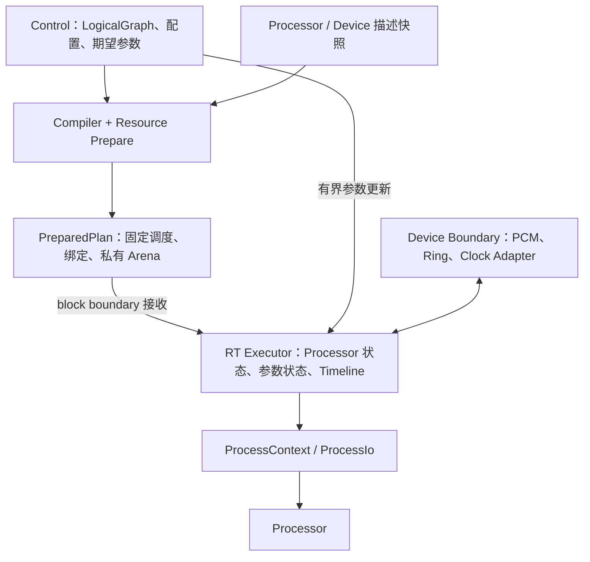

我已读完当前项目源码、配置、README、三份设计文档和 PRD，没有修改代码或文档。

我的判断是：**现有总体架构值得继续推进，暂时没有理由推倒重来。最有利的调整，是补齐执行契约和资源所有权，再通过小闭环验证接口。** 当前最大的风险集中在 ProcessIo 借用、Processor 状态复用、参数与结构变化的分类，以及 Windows 设备边界。

先明确实际进度，避免把讨论成果当成已经完成的实现：

| 部分 | 当前工作区的真实状态 |
|---|---|
| `moiren-core` | 仍是模板代码，尚无 LogicalGraph |
| Buffer | 已实现每 Slot 独立 `Box<[S]>`、planar storage 和临时 views |
| Sample | 已支持 f32/f64；当前 trait 已包含 `MulAssign + AddAssign` |
| Processor | 只有未完成的 Context、Io、Params 骨架 |
| Compiler / ExecutionPlan / Executor | 尚未实现 |
| 参数通道、plan 交换、设备后端、GUI | 尚未实现 |

其中，讨论稿中的数学 trait 状态已落后于 [sample.rs](/D:/coding/moiren/crates/moiren-engine/src/sample.rs:3)。[processors/mod.rs](/D:/coding/moiren/crates/moiren-engine/src/processors/mod.rs:4) 的两个空结构没有泛型参数，却被 Context 带泛型使用；本轮运行的 Cargo 检查和测试因此无法通过，有三个 `E0107`。这属于正在写的骨架，不影响总体架构判断，但目前还不能声称引擎闭环已经成立。

对后续推进，我比较了三种方式：

| 方式 | 收益 | 代价与判断 |
|---|---|---|
| **先跑通执行闭环，逐步增加图编译与优化** | 尽早验证真实 Rust 接口，问题定位清楚 | **推荐** |
| 先完整实现 BufferPlanner、alias 和所有 ProcessIo 模式 | 前期设计覆盖全面 | 容易围绕尚未验证的 Processor 接口投入过多 |
| 引擎、Windows 后端、GUI 一起完整开发 | 很快看见产品外形 | 多层同时变化，难以判断问题来自哪里 |

但推荐路线应增加一条并行工作：**尽早做很小的 Windows 可行性实验**，确认捕获、原始播放、设备需求和时钟行为。它不需要等待完整引擎，也不需要提前建设完整后端。

下面是我建议收敛到的架构。



这里没有增加第二张 Graph。新增的概念只是把**编译结果、已准备资源和正在运行的可变状态**分清楚。

1. **ExecutionPlan 的结构冻结，与运行状态可变，是两件事。**

   “immutable plan snapshot”建议明确解释为：schedule、bindings 和静态 metadata 在发布后不修改。Arena 中的 samples、Compressor envelope、Delay history、参数 smoother 则必须持续变化。

   我推荐由 RT Executor 独占 Processor runtime；PreparedPlan 拥有自己的 Arena，schedule 通过已解析的 handle 引用 Processor。普通连接变化复用同一个 Processor 实例，控制侧仅使用独立的 descriptor/config 快照，不读取或修改正在执行的 DSP 状态。

   这个方向其实已经出现在 [Processor Runtime Lifetime](/D:/coding/moiren/docs/designs/02-engine-design.md:1124)，应优先把它变成明确的所有权协议。否则每次整体换 plan 都重新创建 Processor，会导致滤波状态、包络和尾音被重置。

   初期可以采用预分配的 runtime table，使用 `slot + generation` 标识实例，不需要在 DSP 热路径引入 `Arc<Mutex<_>>`。容量扩展和 processing spec 变化先走明确的重新准备流程，暂不追求任何配置都能无中断热切换。

2. **ProcessIo 的职责可以冻结，具体访问器还不能冻结。**

   Processor 面向逻辑端口，不认识 Arena、SlotId 或 allocator，这条边界正确。单一 `process(ctx)` 入口也值得采用，但它本身不能解决借用问题。

   例如先取 `ctx.io.input(0)`，再取 `ctx.io.output(0)`，如果前者借用了整个 Io，后者仍可能被 Rust 拒绝，即使底层是不同 Slot。因此需要验证“一次拆出合法输入和输出”的接口，而不能只画出几个访问器就认为问题解决了。

   建议第一版明确两种调用形态：

   - Separate：只读 inputs，以及相互不重叠的可写 outputs。
   - In-place：对应区域只提供一个可变 view，Processor 从它读取并写回。

   **同一个区域不能同时构造成独立的 `&[S]` 与 `&mut [S]`。** Compiler 的 last-use 判断不会豁免 Rust 引用规则。[Rust Reference](https://doc.rust-lang.org/reference/behavior-considered-undefined.html)

   所以，你给出的开发顺序需要一个小调整：**通用 N Slot resolver 可以延后，但最小的双 Slot 借用必须进入第一个 Gain 闭环。** 首版 Separate Gain 可用安全的 `split_at_mut` 验证这条路径；之后再扩展 sidechain、Mixer 和 alias 模式。不要先冻结一个只能支持单 Slot 原地处理的接口。

3. **In-place 校验必须覆盖同一次 invocation 内的全部读写关系。**

   当前文档主要强调 last consumer，这还不够。

   假设同一个源连接 Bus 的两个输入：

   ```text
   Source ─→ Bus.Input0
      └────→ Bus.Input1
   ```

   两项都可能读取同一个 signal。即使 Source 的最后使用者是这个 MixOp，把第一项的 Slot 直接作为输出并修改，也会污染第二项随后读取的原始数据。当前 [first-input overwrite 优化](/D:/coding/moiren/docs/designs/02-engine-design.md:662) 缺少这一条件。

   同理，Compressor 的 main 和 sidechain 可以来自同一源，此时 main 的原地写入可能影响 sidechain。

   推荐统一建立每个 operation 的 read/write binding 校验：重复只读输入允许；多个独立可写输出重叠默认禁止；原地写入还要证明当前 operation 的其他读取不会受到影响。**跨 operation 的 liveness 与 operation 内的 alias，都成立后才能复用。**

   Buffer 的物理布局可以继续保持。只有一个封装问题建议在下一轮顺手收紧：[AudioBlock 的 `frames` 和 `channels`](/D:/coding/moiren/crates/moiren-engine/src/buffer.rs:45) 目前公开可写，调用方能修改它们，破坏创建时验证的边界。这会造成跨声道暴露或 panic；当前安全切片仍保证内存安全，但未来 Resolver 不应依赖这种可被外部改写的不变量。

4. **结构变化的定义，应扩大到所有会改变执行契约的配置。**

   “参数更新不重编译”应限定为纯实时参数，例如 Gain、Pan、Mute 和不改变资源布局的 DSP 参数。

   建议按实际影响分类：

   | 操作 | 建议路径 |
   |---|---|
   | Gain / Pan / Mute、Send 数值 | RT 参数更新 |
   | 新增或删除 Edge / Node | 编译新 plan |
   | Rack 添加、删除、重排 Processor | 编译新 plan |
   | 修改端口布局、处理精度、SR、max block | 重新协商、prepare，再发布 |
   | 改变算法资源或延迟的模式、预置 | 依据 descriptor 重新准备或编译 |
   | Pre/Post tap 切换 | 首版建议编译新 plan |

   Rack 重排虽然不改变顶层 Node/Edge，仍然改变执行结构。Pre/Post tap 切换则可能改变读取的 signal 和其存活期；如果要求它完全走参数通道，Compiler 就必须始终保留两个候选信号，承担相应 buffer 成本。

   插件也证明了这个分类的必要性：VST3 支持延迟变化通知，SR 和最大块尺寸需要停用后重配；CLAP 的端口配置也只能在停用状态改变。[VST3 Processing](https://steinbergmedia.github.io/vst3_dev_portal/pages/FAQ/Processing.html)、[CLAP Audio Ports](https://github.com/free-audio/clap/blob/main/include/clap/ext/audio-ports.h)

   因此，单 `process(ctx)` 应只是音频调用入口。Factory、metadata、配置、持久化和生命周期仍然需要控制侧接口，插件 adapter 还要遵守各自的线程要求。

5. **Rack 保留线性主链，但必须补上辅助端口的绑定规则。**

   “线性 Chain + N input/N output”目前还没有完整语义。文档尚未回答：某个 sidechain 送到哪个 Processor？前面一个插件的 aux output 是否经过后面的主链？

   我推荐以下受限规则：

   - 主输入、主输出默认连接相邻 Processor，保持线性顺序。
   - Rack 辅助输入显式绑定到某个 Processor 的某个 input bus。
   - Processor 辅助输出可以显式导出为 Rack output。
   - 导出的辅助输出不会自动经过后续主链。
   - 更复杂的辅助处理继续放在顶层 Graph。

   这能保留 Rack 的简洁性，也能真正承载 sidechain 和 multi-output plugin。配置中使用稳定的 Processor/Port ID；执行时再解析为紧凑索引，避免重排导致绑定对象变化。

   同时，Edge transform 应先有统一语义，再做融合优化。Send Gain/Pan/Mute 不仅要作用于 Bus 输入，也要作用于直连 Rack、Recorder 和 Output 的连接。**融合进 accumulation 是优化手段，不能决定 Edge 在哪些目的节点上才生效。**

6. **参数更新与 plan 交换，都需要完整的有界提交协议。**

   参数层首版不必实现完整 automation，但需要明确：

   - 参数使用稳定身份，删除后以 generation 拒绝旧事件。
   - GUI 拖动可以在 Control 合并；已调度的自动化事件有不同语义。
   - RT 每 block 有明确消费预算，不能无限 drain 一个仍在被补充的队列。
   - queue 满时由 Control 合并或重试，RT 不等待。
   - smoother 的连续状态属于 runtime，普通换图不重置。
   - 普通 plan swap 保持 Timeline；重启或改变 Processing SR 时，用 timeline epoch 区分旧事件。

   Plan 交换建议先限定一份 pending。一次交换同时包含新 plan、新增资源、移除资源，以及容纳旧资源的预分配空间。RT 在边界确认回收通道可用后，再完整提交；回收通道满就延期整个交换，继续运行旧 plan。

   不能先修改 runtime table，再发现旧资源无法回收。也不能只保证 Processor 不析构，却让装载它的 Box、数组或交换容器在 RT 上析构。回收侧还需按 backend 要求，把销毁派发到正确线程。

   这比简单写一句“atomic swap”更接近可实现的 RT 契约。第一版不需要增量编译；先做完整重编译并复用未变化 runtime，已经能解决大部分问题。

7. **设备时钟适配必须提前到首次真实 capture→render。**

   PRD 的 M1 要求 physical capture、多输出和 SRC，却把 master clock、drift 和 async resampling 放到 M3。这是目前最明显的路线依赖冲突。见 [M1](/D:/coding/moiren/docs/Moiren-PRD-Roadmap.md:860) 与 [M3](/D:/coding/moiren/docs/Moiren-PRD-Roadmap.md:905)。

   一个 USB 麦克风接一个独立输出设备，就已经可能跨两个时钟；相同 nominal sample rate 不能保证长期同步。单 Processing Timeline、单 Master、Follower 在 Boundary 适配的方向合理，最小 bridge 应提前包含 ring、预填充、漂移适配和 discontinuity 恢复。高级 master 切换、输出间同步和 ASIO 可以后做。

   Variable Block 可以采用为 Engine 契约，但应由 Boundary 把设备需求转换成合法 processing frames。WASAPI Shared render 的事件不代表固定帧数，需要根据 endpoint buffer 和 padding 计算需求；VST3 也允许每次调用的实际块长度变化，只要不超过已准备的最大值。[GetCurrentPadding](https://learn.microsoft.com/en-us/windows/win32/api/audioclient/nf-audioclient-iaudioclient-getcurrentpadding)、[VST3 Processing](https://steinbergmedia.github.io/vst3_dev_portal/pages/FAQ/Processing.html)

   另外，zero-copy fan-out 的承诺应限定在同步 Graph 执行内部。跨线程的设备桥和 Recorder 必须接收具有足够生命周期的数据，不能把即将复用的 AudioBlock view 直接排进队列。

8. **Windows 产品闭环，应与引擎正确性分别验证。**

   PRD 区分 Capture 与 Takeover 是正确的。Microsoft 的 Process Loopback 示例提供目标进程及其子进程的捕获能力；**从这个 API 不能直接推出原始 render 已被接管或重定向。** 原输出抑制、静音对捕获的影响、OBS 并行捕获，都需要真实应用实验。[Microsoft Application Loopback Sample](https://learn.microsoft.com/en-us/samples/microsoft/windows-classic-samples/applicationloopbackaudio-sample/)

   内部 DAG 也不能防止 Windows 外部回流：捕获一个 render endpoint，再输出到同一个 endpoint，图内仍然可以是 DAG，但声音会重新进入捕获。Boundary 需要识别这类可能路径，并在能支持的捕获模式中排除自身输出；不能把内部 DAG 检查当作完整反馈防护。

   如果 Takeover 尚未解决，首版应继续明确称为 Capture/Monitor。此时可以考虑提前加入一个简单 WAV Recorder，让“应用与麦克风混音、处理、录制并监听”形成完整任务；这比提前建设完整录音工作站小得多。向 Discord 提供处理后的虚拟麦克风，则仍依赖后续系统输入 Endpoint 能力。

模块划分上，当前两个 crate 可以继续，后续扩展到四个已经足够：

| 模块 | 应拥有的职责 |
|---|---|
| `moiren-core` | LogicalGraph、稳定 IDs、Port/Layout、Node/Rack/Edge 配置、领域诊断 |
| `moiren-engine` | Compiler、prepare、plan、executor、buffer、processors、参数与 Timeline |
| `moiren-windows-audio` | WASAPI/MMDevice、Process Loopback、设备生命周期、PCM 与时钟边界 |
| `moiren-app` | Control/session、GUI、持久化、撤销与视图投影 |

Compiler、DSP、插件 adapter 先作为模块存在；等实际依赖和职责稳定后，再考虑独立 crate。GUI 框架目前也无需冻结，后续用真实 Graph 编辑、Meter 刷新和 DPI 场景验证现有 Slint 候选即可。

持久化应保存用户意图，运行时保存解析结果：设备区分精确 Endpoint 与跟随默认角色，应用 selector 与当前 PID 分开，保存稳定 Graph IDs 和 schema version，不保存 SlotId 或 runtime handle。GUI 同时展示 desired revision 与 active revision，编译失败时明确显示哪些编辑未生效。设备缺失保留未解析绑定，不应静默改到另一个输出。

Latency 则应从现在保留 metadata，但按需要逐步实现补偿：Bus 求和路径需要对齐；sidechain 不等于普通混音输入，不能把所有多输入 Processor 一律按最大输入延迟处理。多输出 Rack 最终需要按输出信号传播 latency。Fractional delay 和跨物理输出同步可以延后。

我建议把现有 M0 拆成以下几个可验收阶段：

| 阶段 | 交付内容 | 出口条件 |
|---|---|---|
| M0a：执行调用 | 可编译骨架、Separate Gain、最小 pair resolver、手工 plan | `buffer → gain → buffer`，多种 frames 输出正确 |
| M0b：最小图编译 | 稳定 IDs、端口校验、Rack 主链、Bus、fan-out、保守分配 | 小型非平凡 DAG 能编译并执行；先不复用 Slot |
| M0c：运行中更新 | 参数 ramp、runtime 状态复用、pending plan、非 RT retire | 参数无需编译；普通换图保留状态；失败继续旧图 |
| M0d：优化与证明 | liveness、Slot reuse、in-place、Send fusion | 与保守 plan 结果一致，覆盖重复源和 sidechain alias |
| M1a：Windows 垂直闭环 | render，随后 capture/应用捕获与最小时钟桥 | 连续运行及断连恢复可诊断；明确 Capture/Takeover 边界 |
| M1b：桌面 MVP | Graph/Inspector/Meter、保存加载、多输出 | 编辑与实际播放状态清楚，真实跨设备场景稳定 |

Windows 可行性实验与 M0 并行进行；GUI 的正式建设在 Windows 垂直闭环之后开始。复杂 Buffer 优化不必阻塞最早的设备验证。

最后，建议下一轮先收敛现有文档的权威范围：PRD 管产品承诺，`01` 管 Graph 语义，`02` 管 Engine 契约，`00` 保留愿景和历史方向。当前 variable block 的“已定/待定”、Buffer Pool/Planner、Processor 签名和开发顺序都有冲突，需要逐条统一，并为候选决策记录验证条件。

**如果现在只选择一个开发目标，我建议是：用一个 Separate Gain、一份手工 PreparedPlan 和最小安全 Resolver，跑通第一个执行闭环。** 同时把 Processor runtime 的归属写清楚。这样既能验证你最看重的逻辑 I/O 边界，也能给后续 Graph Compiler、参数更新和 plan 交换提供可靠基础。