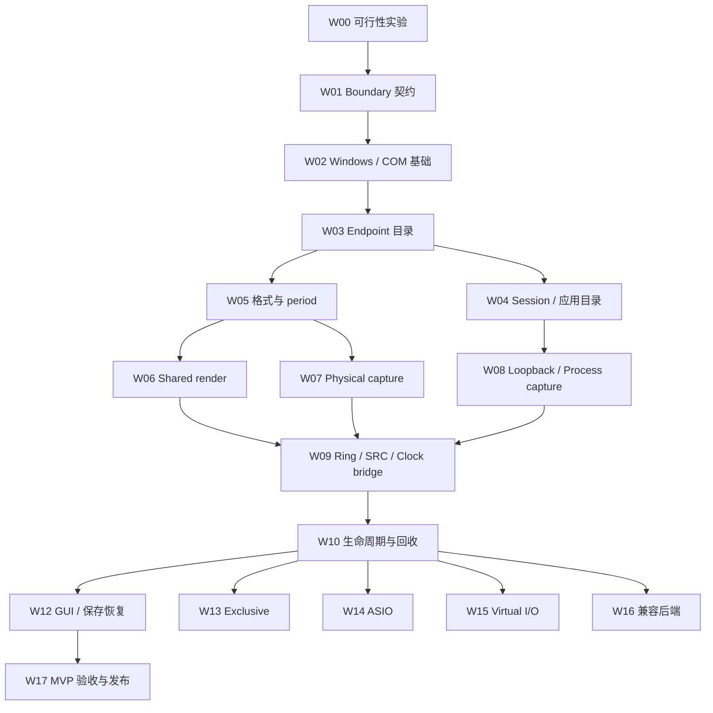

# Moiren Windows 音频接入工作计划

> 日期：2026-10-08  
> 状态：工作分解与验证计划；后端实现尚未开始  
> 范围：Windows 设备、应用音频、WASAPI、设备时钟、生命周期、桌面集成，以及后续 ASIO / 虚拟 I/O  
> 执行说明：按阶段拆成独立实现任务；每项完成后记录验证结果，再进入依赖它的任务。本文件不冻结尚未验证的 Rust 签名，也不要求一次实现全部后端。

**Goal：**让 Windows 应用与物理设备音频通过明确的 Boundary 接入 Moiren，在可解释的格式、时钟和生命周期契约下稳定运行。

**Architecture：**保持 `LogicalGraph → Compiler → ExecutionPlan → Executor → Processor`。Windows backend 负责设备与 COM 对象、packet、PCM 和事件；Boundary bridge 负责跨线程数据、SRC 与 clock adaptation。Graph 和普通 DSP 不访问 Windows 接口。Control 协调配置、资源准备、plan 发布与恢复。

**Tech Stack：**Rust；Microsoft `windows` bindings；MMDevice / WASAPI / Audio Session / Process Loopback / MMCSS；后续按独立里程碑评估 Steinberg ASIO SDK、WDK / WaveRT / SysVAD。

## 1. 文档依据与当前基线

- [PRD 与路线图](../Moiren-PRD-Roadmap.md)：产品范围、Capture / Takeover、MVP 与长期能力。
- [Graph 设计](../designs/01-audio-graph.md)：唯一 LogicalGraph、Port、显式 Input / Output Node。
- [Engine 设计](../designs/02-engine-design.md)：单 Graph RT 执行、Processing Timeline、设备 Boundary 与 SRC / drift 的分离。
- [整体架构评估](2026-10-07%20plan.md)：先验证执行闭环、runtime 状态复用、Windows 可行性实验并行开展。

当前 workspace 只有 `moiren-core` 和 `moiren-engine`；已有 Buffer / Sample 基础和正在编写的 Processor 骨架，没有 Windows backend、Boundary bridge、设备目录或应用音频目录。本文件的复选框表示未来工作，不表示已有实现或已通过实机验证。

PRD 的 M1 已包含物理输入和多输出，而 clock adaptation 在原路线中较晚。这里调整依赖：**首次独立 capture → render 就需要最小跨时钟适配；多个物理输出必须在 follower bridge 验证后交付。**完整专业设备管理、自动 master 切换和输出间同步仍可后置。

## 2. 全局约束

1. 初期目标为 Windows 11、x64、原生桌面应用；具体最低 build 与可选能力通过 W00 实验登记。不能仅凭版本号认定某个设备支持某项能力。
2. 默认内部处理为 planar `f32`；PCM bit depth、packing、interleaving 留在 Boundary。`f64` 保留扩展余地，不要求首轮交付完整双精度设备链。
3. 一个 Graph RT 执行者、一个 Processing Timeline、一个 master clock source。Follower 不额外执行一遍 Graph，也不推进 Graph Timeline。
4. RT process 路径无动态分配、释放、阻塞锁、设备枚举、文件 I/O、同步 UI 操作或无界队列消费。设备准备与清理发生在非 streaming 阶段。
5. Windows-owned packet 指针只在对应 buffer lease 内使用；跨线程传输使用 bridge 拥有的存储，禁止把 `AudioBlock` 或 WASAPI packet 指针排入长期队列。
6. 设备选择意图、运行时解析、当前 active 资源分别建模。Node、Edge 和用户选择不因设备失联而被删除。
7. Shared stream format、Windows mix format、Processing SR 和可获知的硬件格式分别展示。未知硬件信息保留 Unknown，不能将 mix format 直接称为硬件格式。
8. Capture / Monitor 与 Redirect / Takeover 分开验收。Process Loopback 不自动等于接管原始输出。
9. 内部 Bus 不创建 Windows Endpoint。虚拟设备属于后续独立系统集成工作。
10. 本计划覆盖所有已知 Windows 工作，但高级功能不能成为首个 Shared Mode 闭环的前置条件。

## 3. 阶段与依赖

| 阶段 | 工作项 | 可交付能力 | 出口条件 |
|---|---|---|---|
| A：可行性与契约 | W00、W01 | 能力实验、Boundary 契约、支持范围 | 核心场景有实验记录；Capture / Takeover 未混淆 |
| B：Windows 基础 | W02–W05 | 设备 / session 目录、身份、格式、period 协商 | 能可靠发现和解析资源，所有失败可分类 |
| C：单 master 输出 | W06、W11 基础 | fake source / engine → Shared render | 可变需求正确、无 RT 分配、启动停止完整 |
| D：输入与应用 | W07–W10 | capture / loopback → Graph → render | 最小 bridge、跨钟稳定性、恢复和回流约束成立 |
| E：桌面 MVP | W12、W17 | GUI 接入、持久化、多输出、可发布诊断 | 真实任务长期运行，desired / active 状态清晰 |
| F：专业与系统能力 | W13–W16 | Exclusive、ASIO、虚拟 I/O、兼容后端 | 各自完成独立可行性、生命周期和发布验证 |

W00 可与引擎 M0 并行，不等待完整 Compiler 或 BufferPlanner。W06 正式接入需要最小可执行 Executor；W07 的独立捕获实验可以提前，但 capture → render 的稳定交付必须同时完成 W09。W08 的独立 Process Loopback 实验也可以提前，正式产品接入仍依赖身份、bridge 和生命周期契约。



W11 的调度、统计与延迟测量贯穿 C–F，不等到最后才增加。

## 4. 模块与交付物归属

| 位置 | 职责与预计交付物 |
|---|---|
| `crates/moiren-core/src/` | 持久化 device / application selector、Port/Layout、配置值、领域状态；不持有 COM 或设备运行实例 |
| `crates/moiren-engine/src/` | Boundary 逻辑契约、bridge、Processing Timeline、RT demand、参数 / plan 协调；保持 fake backend 可测试 |
| `crates/moiren-windows-audio/src/` | 新建 Windows backend：COM owner、Endpoint / Session 目录、WASAPI stream、Process Loopback、MMCSS、Windows 错误映射 |
| `crates/moiren-windows-audio/examples/` | 可独立运行的能力实验、render / capture / loopback 探针；文件写入仅在非 RT 线程 |
| `crates/moiren-windows-audio/tests/` | 纯格式与状态测试、可选实机集成测试；无硬件时明确跳过设备测试 |
| `crates/moiren-app/` | 后续 Control/session、GUI、持久化、恢复协调、用户错误提示；UI 不直接开关 stream |
| `docs/experiments/windows/` | 实验条件、原始统计、结论、支持矩阵；实现 W00 时创建，不在本轮生成虚构结果 |
| `driver/moiren-vad/` | 仅 W15 路线通过后创建；用户态引擎不迁入 driver |

文件内部按实际职责逐步拆为 catalog、sessions、wasapi、process_loopback、format、threading、error 等模块；不要先创建所有空模块。Boundary bridge 算法与 Windows transport 可以分开放置，避免 engine 依赖 Windows 类型。第三方 WASAPI wrapper 可用于实验，但公共 Graph / Processor 契约不依赖 wrapper 的对象模型。

## 5. 工作项

### W00 — Windows 可行性实验与支持矩阵（P0，可并行）

**依赖：**无需完整引擎。**交付：**可重复的探针、机器 / OS / driver / format 记录、支持矩阵与每项实验结论。

- [ ] 记录 OS build、CPU 架构、驱动版本、设备型号、连接方式、默认角色、增强 / spatial 设置与电源状态。
- [ ] Shared render：播放已知测试信号，记录实际 buffer size、period、每次可写 frames 和 event 间隔。
- [ ] Physical capture：记录 packet frames、flags、device / QPC timestamp，包含无声音和设备失联。
- [ ] Process Loopback：覆盖单进程应用、浏览器多进程、子进程启动退出、应用无音频、应用重启、PID 复用防护。
- [ ] Capture / Takeover：分别观察原始输出、Moiren 捕获输出；实验 session mute / volume、应用自行切换输出、endpoint 音量、OBS 并行捕获、shared / exclusive / 受保护内容。
- [ ] 普通 loopback：确认捕获范围、默认输出变化和 Moiren 自身 render 是否进入捕获；记录外部反馈路径。
- [ ] 独立 capture + render 与双 render endpoint：采集长期 ring / timestamp 数据，不把短时能出声当作跨钟稳定。
- [ ] 输出三类结论：已实测支持、已知不支持、需要指定条件。Takeover 失败也必须形成结论，不能把它写成待实现即必然可行的功能。

**验收：**每个实验有操作步骤、观测数据、预期 / 实际差异和适用范围。若 Takeover 不成立，MVP 使用 Capture / Monitor 命名，必要时以简单 Recorder + 监听形成任务闭环。实验结果是后续 API 选择依据，不能用示例代码存在代替实测。

Process Loopback 的官方示例捕获目标 PID 与子进程，支持从 build 20348 起的系统；Moiren 仍以 Windows 11 为首轮产品目标。[Microsoft Application Loopback Sample](https://learn.microsoft.com/en-us/samples/microsoft/windows-classic-samples/applicationloopbackaudio-sample/)

### W01 — Boundary、身份与时间契约（P0）

**依赖：**W00 的首轮数据、现有 Graph / Engine 边界。**交付：**可实现的契约文档和纯数据模型；具体 Rust 签名在实现任务中验证。

- [ ] 区分持久化 `PinnedEndpoint` 与 `FollowDefault(flow, role)`；定义 unresolved、重新绑定和显式用户替换规则。
- [ ] 区分 application selector、实际 process tree、audio session 和本次 capture instance；PID 附进程创建身份，不能作为永久配置。
- [ ] Boundary descriptor 记录方向、协商格式、period、buffer capacity、clock role、generation 和诊断能力；这些是 immutable 控制侧快照。
- [ ] 定义 master demand 的 frames 单位、零需求、超过 `max_block_frames` 的拆分、SR 不同情况下的分数累计与 SRC 状态。
- [ ] 定义 source 不可用时的 silence / 停止策略、sink 不可用时的 discard / 停止策略；默认不悄悄切换到另一台设备。
- [ ] 定义运行状态、pending / active 配置、资源 generation、plan revision、timeline epoch，各自负责不同身份。
- [ ] 规定 Graph plan 仅使用已准备的 Boundary lease / ring；COM 对象由 Windows owner 管理。删除节点要等待 Graph 和设备 worker 都停止访问资源。
- [ ] 首轮 master 失联采用明确暂停与重新启动协议；自动无缝 master 切换单列后续工作。

**验收：**fake backend 可表示缺失资源、可变 demand、format 改变和 stop / retire；Graph / Processor API 不需要导入 COM、HRESULT 或 WASAPI packet 类型。

### W02 — Windows bindings、COM 与线程基础（P0）

**依赖：**W01。**交付：**最小 Windows crate、COM / HANDLE / callback owner、错误分类与线程生命周期。

- [ ] 从 Microsoft `windows` bindings 选择所需 Win32 feature，固定依赖与 lockfile；Windows-specific 依赖留在 backend，engine 单独可构建测试。
- [ ] 为 catalog / session worker、boundary worker、异步 activation 明确 apartment、创建线程、调用线程、最终释放线程和停机次序。
- [ ] COM 初始化与反初始化成对管理，正确处理 `S_FALSE` 与 `RPC_E_CHANGED_MODE`；不得直接搬移 raw COM pointer 或笼统添加 `unsafe Send/Sync`。
- [ ] 管理 event HANDLE、`CoTaskMemFree`、property variant、callback registration、async operation 与取消后的迟到 completion。
- [ ] Windows 回调只提交轻量通知；非阻塞、可重入、队列满可设置重新扫描标志。音频 RT 队列与 OS 通知队列不共用假定的单 producer。
- [ ] callback 内不注销自身、不释放相关对象的最后引用；注册 guard 按各 API 的 AddRef / Release 行为分别管理，不假设所有注册都持有回调引用。
- [ ] 按 HRESULT 分类 format unsupported、device invalidated、service stopped、device in use、access denied、初始化与调用次序错误；保留原始错误供诊断。
- [ ] 启动、正常停止、部分初始化失败和取消均执行有序清理；callback / FFI 边界不传播 Rust panic。

**验收：**反复启动停止、每个初始化步骤失败注入和迟到 callback 不泄漏 HANDLE / COM owner，不回调已销毁对象；UI 响应不等待设备 I/O。

WASAPI service 的最终释放有线程约束，因此非 RT 回收应派发到 owner 的非 streaming 阶段，而非统一在 Control 线程 drop。[CoInitializeEx](https://learn.microsoft.com/en-us/windows/win32/api/combaseapi/nf-combaseapi-coinitializeex)、[IAudioClient::GetService](https://learn.microsoft.com/en-us/windows/win32/api/audioclient/nf-audioclient-iaudioclient-getservice)、[Microsoft windows-rs](https://github.com/microsoft/windows-rs)

### W03 — Endpoint 目录、选择与通知（P0）

**依赖：**W02。**交付：**设备目录快照、selector resolution、设备与默认角色事件。

- [ ] 枚举 capture / render 的 active、disabled、unplugged、not-present 状态；收集名称、flow、默认角色、Endpoint ID、可用的 StableId 与属性。
- [ ] Endpoint ID 和 StableId 均按 opaque 值保存。能力探测 StableId；不保证所有 endpoint 有该属性，不规范化其大小写。
- [ ] Pinned 选择优先按可用的 StableId 恢复，保留 legacy ID 降级；失败保留 unresolved，不根据友好名称静默绑定同名设备。
- [ ] FollowDefault 分别处理 console / multimedia / communications 和 capture / render；默认变更只影响跟随该角色的节点。
- [ ] 注册设备添加、删除、状态、属性和默认变化通知；合并事件，并以重新枚举校正目录。
- [ ] notification 参数只在 callback 内有效，复制所需 identity 或设置重新扫描标志；处理 default device 为 NULL。
- [ ] 注册 owner 保持 callback 存活并在退出时注销；设备目录查询不通过批量开启 Exclusive stream 试探占用。

MMDevice notification 注册不会替调用方持有 callback 的 COM 引用，registration owner 必须保持其存活；callback 内不注销自身、不等待、不释放相关对象的最后引用。[RegisterEndpointNotificationCallback](https://learn.microsoft.com/en-us/windows/win32/api/mmdeviceapi/nf-mmdeviceapi-immdeviceenumerator-registerendpointnotificationcallback)

**验收：**同名双设备、USB 拔插、重命名、禁用 / 启用、无默认设备、默认角色切换、StableId 缺失与旧 ID 失效均可恢复或明确 unresolved；Pinned 不跟随默认变化。

Windows 11 24H2 / build 26100 起提供 StableId，但属性可缺失、读取失败或失效；解析后仍须重新读取可变名称和格式。[Endpoint ID Strings](https://learn.microsoft.com/en-us/windows/win32/coreaudio/endpoint-id-strings)、[PKEY_AudioEndpoint_StableId](https://learn.microsoft.com/en-us/windows/win32/coreaudio/pkey-audioendpoint-stableid)、[IMMNotificationClient](https://learn.microsoft.com/en-us/windows/win32/api/mmdeviceapi/nn-mmdeviceapi-immnotificationclient)

### W04 — Audio Session 目录与应用身份（P0）

**依赖：**W02、W03。**交付：**应用 / session 目录、selector 匹配、生命周期与重复捕获检测。

- [ ] 对相关 render endpoint 建 session registry，合并首次枚举与新 session 通知；默认 endpoint 上的枚举不能代表全系统。
- [ ] 在 non-UI MTA worker 管理 session 通知；按注册、初始枚举 / GetCount 和合并顺序覆盖注册期间的竞态。
- [ ] 初始化通知必须实际完成 `RegisterSessionNotification → GetSessionEnumerator → GetCount`；session registry 同时接收 state / disconnect 事件，异常服务终止还要通过 API 错误检测。
- [ ] Session notification 注册会持有 callback 引用，与 MMDevice registration 不同；独立验证注销、并发 callback 与最后引用释放次序。
- [ ] 保存 runtime endpoint identity、session instance ID、process identity、状态和 system-sounds 标记；显示名或图标失效不导致采集失败。
- [ ] 处理同应用多 session、跨进程 session、无单一 PID、系统声音和进程查询权限失败；禁止假设 application = session = PID。
- [ ] 持久化 selector 明确按 executable / package identity / 用户选择匹配；多个候选由用户确认或使用显式规则，不误跟踪被复用的 PID。
- [ ] 多进程应用 UI 说明捕获进程树范围；单浏览器标签页与单 session 不自动承诺可独立捕获。
- [ ] 一个进程的多个 session 不重复开启同范围 Process Loopback；对多个 application source 的重叠进程树给出重复混音诊断。

**验收：**应用退出重开、浏览器子进程变化、多 endpoint 输出、跨进程 session 和列表快速变化均不会绑错进程或重复混入同一捕获范围。

Session 枚举属于单个 endpoint，枚举与通知需要合并；`GetProcessId` 可返回无单一进程的状态。[RegisterSessionNotification](https://learn.microsoft.com/en-us/windows/win32/api/audiopolicy/nf-audiopolicy-iaudiosessionmanager2-registersessionnotification)、[IAudioSessionEnumerator](https://learn.microsoft.com/en-us/windows/win32/api/audiopolicy/nn-audiopolicy-iaudiosessionenumerator)、[GetProcessId](https://learn.microsoft.com/en-us/windows/win32/api/audiopolicy/nf-audiopolicy-iaudiosessioncontrol2-getprocessid)、[GetSessionInstanceIdentifier](https://learn.microsoft.com/en-us/windows/win32/api/audiopolicy/nf-audiopolicy-iaudiosessioncontrol2-getsessioninstanceidentifier)

### W05 — Format、Channel Layout、PCM 与 period 协商（P0）

**依赖：**W02、W03。**交付：**经过验证的 stream descriptor、PCM converter 与格式 / period 选择策略。

- [ ] Shared 首轮优先使用支持的 mix format；区分 `IsFormatSupported` 的 exact、closest match 与 unsupported，正确释放返回的格式内存。
- [ ] 解析 `WAVEFORMATEX` / `WAVEFORMATEXTENSIBLE`，验证 SubFormat、channels、SR、block alignment、container bits、valid bits 和 channel mask。
- [ ] 实现 interleave / deinterleave 与 PCM 转换：优先真实设备所需 f32 / i16，其余 i24 packed、i24-in-i32、i32、f64 按能力矩阵增加。处理符号扩展、valid bits 和饱和；定义 NaN / Inf 输出策略。
- [ ] 保留浮点 Graph headroom；量化 / clipping 仅在相应 Boundary 策略发生。Dither 如启用也属于输出量化策略。
- [ ] Channel mask 决定语义与顺序；未知布局使用 Discrete，不根据 channel count 猜出 5.1。Downmix / 有损映射需要显式策略。
- [ ] 获取实际 stream buffer size；period、buffer size 和 Graph max block 分开。Shared 低延迟采用 `IAudioClient3` 能力查询，验证 min / max / fundamental period。
- [ ] 首轮使用可成功初始化的默认 period；低 period 请求失败或被锁定时按明确策略降级并报告 requested / actual，不能静默改变设备模式。
- [ ] 明确由 Moiren 或系统执行的格式 / SRC 适配，不重复转换；记下 shared APO / enhancements 可能影响的处理范围，RAW 另作后续能力验证。

**验收：**已知数字序列验证每个 PCM converter 的端序、声道顺序、零值和边界值；设备请求格式不支持时有明确结果；default / min / 非法 period 情况都可诊断。

Valid bits 与 container bits、channel mask 是不同字段；Shared period 必须在设备允许范围内并满足 fundamental 倍数。[WAVEFORMATEXTENSIBLE](https://learn.microsoft.com/en-us/windows/win32/api/mmreg/ns-mmreg-waveformatextensible)、[IsFormatSupported](https://learn.microsoft.com/en-us/windows/win32/api/audioclient/nf-audioclient-iaudioclient-isformatsupported)、[GetSharedModeEnginePeriod](https://learn.microsoft.com/en-us/windows/win32/api/audioclient/nf-audioclient-iaudioclient3-getsharedmodeengineperiod)、[InitializeSharedAudioStream](https://learn.microsoft.com/en-us/windows/win32/api/audioclient/nf-audioclient-iaudioclient3-initializesharedaudiostream)

### W06 — Shared event-driven render 与 master demand（P0）

**依赖：**W01–W03、W05、最小 Engine Executor。**交付：**可执行的单 master 输出链路。

- [ ] 在 owner thread 初始化 client、event 和 render service，准备转换 / staging buffer、预填充，再启动 stream。
- [ ] 每次 wake 按 `actual_buffer_frames - current_padding` 计算可写需求；不能把一次 event 等同于固定 quantum。
- [ ] 对零可写帧跳过 audio render。先由持久 SRC phase / history / demand 求出填满设备 N 帧所需的 Processing frames，再按 Graph max block 有界拆分；不能直接把 device frames 当作 Graph frames。
- [ ] 首版先验证 master owner 直接驱动唯一 Graph RT 执行的方案；若选择独立 Graph thread，记录新增 ring / demand 通道及延迟成本，不能让两个线程执行同一 Graph。
- [ ] `GetBuffer(N)` 后填满有效 N 帧，不足部分补静音，按协议 `ReleaseBuffer(N)`；请求、释放和错误收尾在同一 owner 上完成。
- [ ] Engine 未准备好、source silence、bridge 欠载和停止过程都有明确输出；复用内存的旧 samples 不得被播放。
- [ ] 等待集合包含独立 control / stop wake。即使没有 audio event 或 demand 为零，仍在执行安全点处理 detach / quiesce 并 ack，不通过调用零帧 DSP 强迫推进停机。超时 / invalidation 上报给 Control，由非 streaming 流程重建。

**验收：**fake source → Gain / Bus → 输出；覆盖不同 event 间隔、0 / 小 / 多 block 需求、全静音、CPU 压力和重复启停。音频线程无分配 / 析构，实际提交帧数与请求一致。

[GetCurrentPadding](https://learn.microsoft.com/en-us/windows/win32/api/audioclient/nf-audioclient-iaudioclient-getcurrentpadding)、[IAudioRenderClient::GetBuffer](https://learn.microsoft.com/en-us/windows/win32/api/audioclient/nf-audioclient-iaudiorenderclient-getbuffer)、[IAudioRenderClient::ReleaseBuffer](https://learn.microsoft.com/en-us/windows/win32/api/audioclient/nf-audioclient-iaudiorenderclient-releasebuffer)

### W07 — Physical capture 与 packet 协议（P0）

**依赖：**W02、W03、W05；连接 Graph / render 时另依赖 W09。**交付：**采集 stream、packet metadata、input bridge。

- [ ] 初始化 event-driven capture；一次 wake 按完整 packet 消费可用数据，而不是假设一个 event 只有一个 packet。
- [ ] `GetBuffer` / `ReleaseBuffer` 成对且同线程；转换或复制到 bridge 拥有的存储后立即归还 packet。
- [ ] `SILENT` 时不读取 data pointer；按照 packet frame count 生成 silence。分别处理 `DATA_DISCONTINUITY` 和 `TIMESTAMP_ERROR`。
- [ ] 设备采样帧与 processing frames 分开。首版整 packet 检查容量、复制并一次提交，不部分接纳；不足则整包丢弃并 `ReleaseBuffer(packet_frames)`。丢弃不能用 `ReleaseBuffer(0)`，否则同包会再次呈现。
- [ ] 约束每次服务的工作量。达到预算但仍有 packet 时设置 pending service，由 worker 有界继续服务并优先检查 stop / control；不能仅等待新的 audio event，否则无后续事件时会遗留 packet。队列压力下及时释放并记录丢弃。
- [ ] microphone 隐私拒绝、没有音频、endpoint invalidated 和 stream 初始化失败分别显示，不统一解释为静音。

**验收：**mono mic、stereo input、silence flag、连续 packet、超大 packet、ring 满、timestamp error 和拔插；增加多 packet 耗尽预算且后续无新事件的场景。所有已获取 packet 正确释放，跨线程无悬挂引用。

[IAudioCaptureClient::GetBuffer](https://learn.microsoft.com/en-us/windows/win32/api/audioclient/nf-audioclient-iaudiocaptureclient-getbuffer)、[ReleaseBuffer](https://learn.microsoft.com/en-us/windows/win32/api/audioclient/nf-audioclient-iaudiocaptureclient-releasebuffer)、[GetNextPacketSize](https://learn.microsoft.com/en-us/windows/win32/api/audioclient/nf-audioclient-iaudiocaptureclient-getnextpacketsize)

### W08 — Endpoint Loopback、Process Loopback 与 Takeover 实验（P0；Takeover 独立 Gate）

**依赖：**W00、W02、W04、W05；产品数据链另依赖 W09、W10。**交付：**两类明确区分的 capture source、异步 activation owner、能力状态和回流检测。

- [ ] Endpoint Loopback 绑定明确 render endpoint，使用 Shared capture 语义；默认 endpoint 改变是否跟随由 selector 决定。
- [ ] Process Loopback 用 activation parameters 声明目标 PID 与 include / exclude process tree；保持参数、completion handler 和 operation 的有效生命周期。
- [ ] 异步完成后检查 activation result；取消后迟到的成功对象仍须正确回收，不能发布到已经删除的 Node。
- [ ] 请求绑定 `(NodeId, selector/config revision, activation generation)`；换 selector、删除 Node 或服务重启作废旧请求。逻辑取消后 operation / handler 保持到 completion，旧成功结果只清理、不发布。
- [ ] 检查 `GetActivateResult` 自身的 HRESULT 和输出的 activation HRESULT；completion handler 满足 agile / apartment 规则，不把创建异步 operation 成功当作激活成功。
- [ ] Capture format 按实际 activation / 初始化能力验证；virtual process capture 不套用普通硬件 client 的所有查询假设。
- [ ] 对应用无 render stream、子进程变化、目标退出、进程权限、并行 OBS 捕获和受保护内容形成支持 / 错误语义。
- [ ] 对 endpoint loopback → 可达同 endpoint 输出的已知反馈路径，首版默认拒绝该连接并给出原因；未知外部路径标为无法完整判断。该规则是产品建议，实测后再决定是否提供显式高级覆盖。
- [ ] 普通 endpoint loopback 不宣称支持按 PID 排除 Moiren；Process Loopback 的 exclude 模式与 endpoint mix 捕获范围不同，UI 不将两者显示成同一能力。
- [ ] Takeover 候选必须单独完成原始 render 抑制、并行捕获共存、恢复旧设置、应用退出 / 重启和权限验证。不得依赖未公开的 policy 接口作为稳定 MVP 契约。
- [ ] 检测重复 / 重叠捕获范围，标注原始 Windows 播放仍存在；不得用 Node 内部 DAG 检查代替系统回流防护。

**验收：**每个 source 明确显示捕获范围和是否保留原始播放；取消、重启、重复范围和外部反馈路径均可解释。只有 Takeover 全部 Gate 通过后才承诺重定向。

[Loopback Recording](https://learn.microsoft.com/en-us/windows/win32/coreaudio/loopback-recording)、[PROCESS_LOOPBACK_MODE](https://learn.microsoft.com/en-us/windows/win32/api/audioclientactivationparams/ne-audioclientactivationparams-process_loopback_mode)、[Application Loopback Sample](https://learn.microsoft.com/en-us/samples/microsoft/windows-classic-samples/applicationloopbackaudio-sample/)、[ActivateAudioInterfaceAsync](https://learn.microsoft.com/en-us/windows/win32/api/mmdeviceapi/nf-mmdeviceapi-activateaudiointerfaceasync)

### W09 — SPSC、SRC、device clock bridge 与多输出（P0）

**依赖：**W01、W05、W06；输入接入与 W07 / W08 联合验证。**交付：**input / follower output bridge、clock adapter 与模拟时钟测试。

- [ ] 每条 audio ring 有唯一 producer / consumer，启动前分配；明确数据与 metadata 的提交顺序、帧容量、target fill、预填充和耗尽策略。
- [ ] 首版 input overflow 丢弃新完整 packet，并在下次成功提交时标记 discontinuity；producer 不修改 consumer cursor。consumer 若要减少旧积压，由自己推进读游标并标记时间跳变。
- [ ] 明确 underrun 补静音、整 packet 接纳 / 丢弃、旧音频最大积压和 telemetry drop；容量覆盖支持的最大 packet，超过预分配上限的包明确丢弃并报告。部分接纳是后续独立策略，RT 不扩容或等待另一设备。
- [ ] 固定比率 SRC 处理 nominal SR 不同；Async SRC 处理独立时钟漂移，即使两端 nominal SR 都是 48 kHz。
- [ ] Master nominal SR 不等于 Processing SR 时，根据 SRC 实际输入需求及累计 phase / history 产生 Graph frames；随后按 Graph max block 拆分，最终满足设备 N 帧。不仅用名义比例乘除估算，不逐 callback 独立四舍五入。
- [ ] 使用有效 device / QPC timestamp 观察长期速率，ring fill 作为平滑反馈；限制 correction 与 slew，不能把 callback jitter 当成全部 drift。
- [ ] `IAudioClock` position 用 `GetFrequency` 换成时间；capture packet device position 是 frames。API 返回的 QPC position 已换算为 100 ns，不当成 raw QPC ticks。
- [ ] 单独 `TIMESTAMP_ERROR` 保留有效音频、跳过该时钟观测，不因此 reset、丢弃音频或更新 epoch；实际 restart、大间断、underrun / overflow 按策略 reset / re-center / fade。
- [ ] 局部 bridge / stream reset 更新本地 generation；只有 Graph Timeline 重启或 Processing SR 等时间坐标改变才更新全局 timeline epoch。普通资源重开是否保持 Timeline 由 Control 明确决定，双方停止访问前不能同时改 ring 游标。
- [ ] Follower output 只消费 Graph 结果，独立服务自己的设备；每个独立输入和输出分别适配，不能让 follower 重跑 Processor。
- [ ] 容量根据实际 period、允许 jitter 与延迟目标计算；示例 4096 / 2048 不固化为所有设备默认值。
- [ ] 单输出 capture → render 验证后，再交付双输出 / 多输出。跨输出同时发声对齐是独立策略，不默认拖慢低延迟输出。

**验收：**模拟相同 SR 下 ±100 / ±300 ppm、44.1 ↔ 48 kHz、不同 packet / callback 长度与大跳变；ring fill 不持续单向漂移，无长期帧数累计错误。实机持续运行至少 2 小时并记录 fill、ratio、drops、XRUN 和恢复事件，异常可区分系统间断与引擎错误。

[IAudioClock::GetPosition](https://learn.microsoft.com/en-us/windows/win32/api/audioclient/nf-audioclient-iaudioclock-getposition)、[GetFrequency](https://learn.microsoft.com/en-us/windows/win32/api/audioclient/nf-audioclient-iaudioclock-getfrequency)、[Capture GetBuffer](https://learn.microsoft.com/en-us/windows/win32/api/audioclient/nf-audioclient-iaudiocaptureclient-getbuffer)

### W10 — 生命周期、热插拔、重配与资源回收（P0）

**依赖：**W01–W03、W06–W09、Engine plan exchange。**交付：**Control 状态机、owner command / ack、重试与资源 retire 协议。

- [ ] 采用能区分 Unresolved、Preparing、Prepared、Running、Stopping、Recovering、Failed 的运行状态；保留原因、generation 与 requested / actual 配置。
- [ ] 处理添加、删除、禁用、默认变化、property / format 变化、音频服务停止、权限变化、sleep / resume 和 USB / Bluetooth 重连。
- [ ] 音频服务异常退出可能没有 disconnect 通知，WASAPI 调用错误也触发 reconcile；power resume 通知去重，避免自动唤醒与用户唤醒重复创建资源。
- [ ] master 失联且再无 audio event 时，stop / control event 仍能推进停机与 Graph quiesce ack；不能等待永远不会到来的下一次 callback 才回收。
- [ ] 正常停机先从 active Graph 解绑或切到明确 silence / discard，再停 worker；故障 owner 可以先停止 / park streaming，但保留 bridge，随后通过独立 control wake 在安全点完成 Graph detach / ack。Graph ack 与设备 owner ack 均到达后才能回收 bridge。
- [ ] `IAudioClient` / render / capture service 在规定 owner 上最终释放。owner 停止 streaming 后进入清理阶段；不能把 COM wrapper 统一搬到 Control drop。
- [ ] 新 stream 与 converter 在非 RT 准备，成功后发布一致 descriptor / plan；失败保留期望配置和明确状态，仍健康的旧 stream 不被提前摧毁。
- [ ] 对无法同时打开新旧 stream 的 Exclusive / 同设备重配，采用显式 quiesce → reopen；暂停、恢复失败和用户回退都有状态，不承诺所有重配都无缝。
- [ ] 有界重试与通知触发重查，避免无设备时持续忙循环。队列满和未完成 retire 延后事务，不产生一半新一半旧的 binding。
- [ ] stream SR / channel / period 变化只重用满足新 spec 的资源；不在 callback 内 resize / reinitialize。
- [ ] 区分可报告的 device-in-use 与未知占用信息，不虚构外部占用进程。Moiren 不强制关闭其他应用设备。
- [ ] 正常退出、关闭 GUI 但保留音频、完整退出采用不同命令；实现完整退出时注销回调、停止 owner、释放对象、join thread。

**验收：**连续拔插和重配、准备期间删除 Node、迟到 callback、服务恢复、睡眠、回收队列满和旧 plan 仍在运行均不发生 UAF、跨线程释放、静默设备替换或无限等待。

[IAudioClient::GetService](https://learn.microsoft.com/en-us/windows/win32/api/audioclient/nf-audioclient-iaudioclient-getservice)、[IAudioCaptureClient](https://learn.microsoft.com/en-us/windows/win32/api/audioclient/nn-audioclient-iaudiocaptureclient)、[IAudioRenderClient](https://learn.microsoft.com/en-us/windows/win32/api/audioclient/nn-audioclient-iaudiorenderclient)、[IMMNotificationClient](https://learn.microsoft.com/en-us/windows/win32/api/mmdeviceapi/nn-mmdeviceapi-immnotificationclient)、[OnSessionDisconnected](https://learn.microsoft.com/en-us/windows/win32/api/audiopolicy/nf-audiopolicy-iaudiosessionevents-onsessiondisconnected)、[WM_POWERBROADCAST](https://learn.microsoft.com/en-us/windows/win32/power/wm-powerbroadcast)

### W11 — MMCSS、RT 预算、Latency 与诊断（P0 基础 / P1 深化）

**依赖：**从 W06 起持续接入。**交付：**线程调度策略、轻量 telemetry、延迟分解和性能报告。

- [ ] 在实际 audio owner 上注册 MMCSS；先使用经测量的 audio task profile，不默认最高优先级或 hard realtime。失败与降级需记录。
- [ ] MMCSS 注册与 revert 在同一线程，覆盖失败 / 停止清理；Control / UI 不继承音频实时优先级。
- [ ] 分别测量 wake jitter、Graph 执行、PCM / SRC、实际 buffer padding、ring fill、欠载 / 溢出和 deadline overrun。
- [ ] 以预分配计数 / snapshot 上报 telemetry；日志格式化、磁盘写入和 UI 刷新在非 RT；UI 慢时丢弃旧 telemetry，不阻塞音频。
- [ ] RT 分配与析构检查覆盖 streaming、plan 接收与错误转移，不只测 Processor kernel。停止后明确进入 owner cleanup 阶段，再允许 COM / HANDLE / storage 析构；最终 Release 的同线程要求不代表要在 streaming 热路径析构。
- [ ] Latency 分解为 capture、bridge、SRC、Graph / PDC、render padding 与可观测设备延迟；声明测量误差与不可见硬件部分。
- [ ] `GetStreamLatency` 是 stream 生命周期内的最大 latency 信息，不直接作为端到端实测值；用 impulse / loopback 实测校准预算，避免把重叠缓冲项重复相加。
- [ ] 所有可累加内部延迟换算到 Processing Timeline frames；设备端 frame 数与 100 ns 时间值不可直接相加。
- [ ] 增加 CPU 压力、窗口拖动、后台应用、不同 period 与电源模式的性能记录；用 ETW / WPR / WPA 做非 RT 调查，不让 profiler 工作进入回调。

**验收：**默认 Shared period、记录的基线机器上连续 30 分钟无自引入 XRUN；压力下若不能满足 deadline，能定位并显示退化。报告实际 period、p99 / max 与总延迟，不先宣称固定毫秒目标。

[MMCSS](https://learn.microsoft.com/en-us/windows/win32/procthread/multimedia-class-scheduler-service)、[AvSetMmThreadCharacteristicsW](https://learn.microsoft.com/en-us/windows/win32/api/avrt/nf-avrt-avsetmmthreadcharacteristicsw)、[AvRevertMmThreadCharacteristics](https://learn.microsoft.com/en-us/windows/win32/api/avrt/nf-avrt-avrevertmmthreadcharacteristics)、[GetStreamLatency](https://learn.microsoft.com/en-us/windows/win32/api/audioclient/nf-audioclient-iaudioclient-getstreamlatency)

### W12 — GUI、持久化、权限与桌面生命周期（P0）

**依赖：**W03、W04、W10、W11 基础。**交付：**Windows 控制状态投影、设备设置、保存恢复和用户错误流。

- [ ] Graph / Inspector / Device Manager 通过 Control command 使用同一目录与配置；UI 不直接持有或调用 audio client。
- [ ] 显示 flow、默认角色、exact / follow-default、requested / negotiated 格式与 period、clock role、Capture / Takeover、missing / recovering 和隐式转换。
- [ ] desired graph / 配置与 active plan revision 分开显示；编辑失败保留旧执行，并指出未生效内容。
- [ ] 项目 schema 保存 selector、StableId / legacy ID fallback、Processing SR 与配置；不保存 COM 指针、PID 永久绑定、buffer slots、当前 availability。
- [ ] 在无原设备、同名新设备和应用未运行时可加载项目；恢复绑定需满足 identity 规则，而非友好名称猜测。
- [ ] 实测麦克风隐私设置、普通用户 / 提权应用、process 查询失败、packaged / unpackaged desktop 的差异；按部署类型决定 manifest / capability，并提供具体失败提示。
- [ ] 声音 / 音量混合器 / microphone privacy 提供公开 Settings 入口，页面不可用时给出操作指引；不静默修改 Windows 默认设备、系统隐私或其他应用的输出设置。
- [ ] DPI / theme / accessibility 与 native 窗口、tray、关闭窗口 / 完整退出策略验证；UI 卡顿或后台模式不改变 audio owner 契约。
- [ ] 自动启动 / 登录后恢复先采用保守 silence 和设备确认策略；首次不自动抢占 Exclusive 或重定向其他应用。

**验收：**保存 / 重启 / 缺失资源 / 权限拒绝时用户能分辨期望与实际路由；不因默认设备变化误绑 Pinned；后台与高 DPI 使用不产生音频线程 UI 调用。

[Launch Windows Settings](https://learn.microsoft.com/en-us/windows/apps/develop/launch/launch-settings)

### W13 — WASAPI Exclusive、多通道与高级 Shared（P1）

**依赖：**Shared 闭环与 W10、W11。**交付：**独占模式能力、显式 format / period 选择和专业设置。

- [ ] Exclusive format support 单独查询，处理 buffer alignment、允许 period 和设备占用；用户显式选择该模式。
- [ ] Exclusive event mode 初始化采用 `hnsPeriodicity == hnsBufferDuration != 0`；alignment error 后查询 aligned frames、重算 duration、释放失败 client 并重新 activate / initialize，重试次数有界。
- [ ] Exclusive event-driven 每次按完整 endpoint buffer 协议处理，不能复用 Shared padding 公式；不在 active stream 修改已初始化 spec。
- [ ] 切换 shared / exclusive 时先协调 stop / prepare，再更新 active 配置；失败显示原因，按用户允许的策略回退。
- [ ] 验证 DAW 占用、被外部 stream 抢占 / invalidated、用户关闭 exclusive 权限和断连恢复。
- [ ] 多通道 mask、独立 mono / stereo / surround layout、Channel Mapper 与未知 layout；支持矩阵逐设备记录。
- [ ] Advanced Shared 评估低 period、RAW、audio category、enhancements / spatial 影响。每项独立能力探测，不以 Shared 模式推断 bit-perfect。

**验收：**至少一个支持 Exclusive 的设备完成长期运行、占用冲突和回退；每个多通道路径通过单声道测试信号验证顺序。Unsupported 能力明确禁用，不影响 Shared 用户。

[IAudioClient::Initialize](https://learn.microsoft.com/en-us/windows/win32/api/audioclient/nf-audioclient-iaudioclient-initialize)、[GetCurrentPadding](https://learn.microsoft.com/en-us/windows/win32/api/audioclient/nf-audioclient-iaudioclient-getcurrentpadding)、[IsFormatSupported](https://learn.microsoft.com/en-us/windows/win32/api/audioclient/nf-audioclient-iaudioclient-isformatsupported)

### W14 — ASIO 接入（后续独立里程碑）

**依赖：**W01、W09–W11、专业设备需求与 SDK 许可确认。**交付：**ASIO 可行性报告，随后是独立 backend / Boundary adapter。

- [ ] 获取 Steinberg 官方 SDK，固定版本，确认 SDK、host wrapper、FFI 与发行方式的许可；不沿用未经核对的历史许可结论。
- [ ] 枚举 driver 与位数，记录 x64 host / driver 兼容性；x86 driver 或 helper process 作为独立产品选择，不自动承诺。
- [ ] 处理 driver 初始化线程、control panel、buffer size / SR 变化、reset request 和 callback 生命周期。
- [ ] 转换 ASIO channel-specific sample type、non-interleaved / double buffer、sample position 与 timestamp；不把 WASAPI PCM 假设复制过去。
- [ ] 决定同一 ASIO driver 全双工的 master / input 关系；与其他设备混用仍通过 Boundary clock bridge。
- [ ] 外部 DAW 占用时保持可解释失败；不假设所有 ASIO driver 支持多 client，不抢占或关闭外部程序。
- [ ] ASIO crash / hang 隔离需求独立评估；若采用 helper process，增加 IPC buffer、clock、延迟和故障恢复测试。

**验收：**指定 SDK / driver 的初始化、全双工、SR / buffer 修改、DAW 共存失败和关闭流程都有记录；SDK 许可与分发路线通过后才合入发布计划。

[Steinberg Developer SDKs](https://www.steinberg.net/developers/)

### W15 — Virtual I/O、Driver 与动态 Expose（后续独立里程碑）

**依赖：**用户态 Graph / Boundary 稳定、具体外部应用场景和驱动可行性。**交付：**技术与发布路线，随后是薄 driver、受控管理组件和用户态 adapter。

- [ ] 用 SysVAD / WaveRT 验证 playback / capture endpoint 与用户态 PCM 桥；Graph、DSP、SRC 和 routing 留在用户态。
- [ ] 区分虚拟 playback endpoint 接收外部应用声音，与虚拟 capture endpoint 向 Discord / OBS 等提供 Bus 音频。
- [ ] 确定 Dynamic Endpoint 的实际 driver 能力、设备实例与子 endpoint 模型；Software Device API 只参与 PnP 管理，不独立承担 PCM 引擎。
- [ ] 区分安装 / 创建所需管理员权限与普通 GUI / engine 运行权限；特权 helper 的授权操作、IPC 边界和失败恢复单独设计。
- [ ] driver ↔ user-mode transport 明确拥有权、格式协商、ring / shared-memory、generation、clock、underrun、user-mode crash 和重启。
- [ ] Expose / Disable、默认角色、外部应用已持有 handle、被使用时删除、engine 未运行等行为逐项验证；不能承诺 UI 取消后所有应用设备列表立即消失。
- [ ] 完成 INF / 包安装、driver signing、升级 / 卸载、回滚与 Windows 更新兼容；开发 test-sign 和正式发布签名分开。
- [ ] 评估未来统一桌面入口或 Takeover 对虚拟 playback 的依赖，保持它是导出 / 系统接入机制，内部 Bus 不自动产生设备。

**验收：**普通应用可选虚拟 playback / microphone，engine 停止或 crash 不导致系统音频死锁；反复 expose / disable、安装升级卸载可恢复。正式签名路线与权限组件完成后才对外发布。

`SwDeviceCreate` 需要管理员权限且成功返回不等于设备创建完成，必须检查异步结果；动态音频能力仍依赖对应 driver。[Sample Audio Drivers](https://learn.microsoft.com/en-us/windows-hardware/drivers/audio/sample-audio-drivers)、[SwDeviceCreate](https://learn.microsoft.com/en-us/windows/win32/api/swdevice/nf-swdevice-swdevicecreate)、[Kernel-Mode Code Signing Requirements](https://learn.microsoft.com/en-us/windows-hardware/drivers/install/kernel-mode-code-signing-requirements--windows-vista-and-later-)

### W16 — MME / DirectSound / KS 等兼容入口（按需求）

**依赖：**明确的设备 / 应用兼容缺口。**交付：**需求证据与独立 backend adapter；没有需求时保持不实现。

- [ ] 先验证目标问题是否能通过 WASAPI Shared / Exclusive 或 ASIO 解决，记录确需兼容 API 的设备与场景。
- [ ] 若实施，复用 Boundary selector、PCM、clock、ring、生命周期与 telemetry 契约，不改变 Graph / Processor 模型。
- [ ] 记录 legacy device identity 与 Endpoint identity 的映射、不支持能力、实际延迟与默认设备规则。
- [ ] KS / 低层 driver 路线单独核验访问权限、格式、占用、同步和稳定性，不默认更低层必然更好。

**验收：**解决具体兼容问题且不降低已有 backend 的可恢复性；新增 API 不成为设备统一模型的根基。

### W17 — 自动化验证、实机验收与发行（P0，贯穿实现）

**依赖：**各工作项按阶段提交。**交付：**可复现测试、支持矩阵、诊断导出与 Windows 应用发行流程。

- [ ] 纯测试覆盖 format / layout、frame-demand phase、ring ownership、drift、状态机、迟到事件和 retire；不依赖真实硬件。
- [ ] 实机测试明确标为 manual / opt-in，检测设备与能力后运行；CI 不把 Windows Server VM 无音频设备解释为产品失败或实机通过。
- [ ] 建立 Windows 11 支持矩阵：可获得的目标 builds、StableId 有 / 无、内置 / USB / HDMI / Bluetooth、不同驱动与 shared / exclusive 能力。
- [ ] 记录通信 ducking、RDP / WTS disconnect、锁屏、登录切换、fast user switching、enhancements / spatial 与电源模式的支持范围；不自动跨用户恢复敏感捕获。
- [ ] 每次记录 requested / actual format、period、buffer、master、converter、设备 / 应用身份、revision、CPU 时间、XRUN 与恢复原因。
- [ ] 建立 native executable 打包、依赖 / license 清单、用户态签名与升级回滚；初期无需服务或 driver 安装，后续安装组件独立交付。
- [ ] 诊断导出可供用户检查，避免默认收集音频内容、完整应用路径或敏感进程信息；日志格式化和写盘不在 RT。
- [ ] 验证正常退出、异常重启、登录后恢复、多实例运行与更新时的设备释放，不留下无限重试或被永久占用的 stream。

后端 crate 建成且引擎基线可编译后，执行以下常规检查；本次文档整理不运行这些未来实现检查：

```powershell
cargo fmt --all --check
cargo check --workspace --all-targets --locked
cargo test --workspace --locked
cargo clippy --workspace --all-targets --locked -- -D warnings
```

**验收：**纯测试与实机结果分别报告；发布说明列支持能力和限制。安装 / 更新 / 卸载可恢复，未执行的硬件场景不记为通过。

## 6. 必须覆盖的验收矩阵

| 类别 | 场景 | 必须观察的结果 |
|---|---|---|
| 身份 | 同名双设备、Pinned / FollowDefault、StableId 缺失或失效 | 无错误自动绑定，配置可恢复或明确 unresolved |
| 应用 | 多 session、子进程、退出重启、PID 复用、OBS 同时捕获 | 捕获范围准确，无重复混音或错误接管 |
| 数据 | f32 / 实际 PCM、mono / stereo / mask、多 packet、SILENT | 帧数与声道正确，旧 samples 不泄漏到输出 |
| 驱动需求 | 0 / variable / 超过 max block、44.1 ↔ 48 kHz | 不执行零帧 DSP，Timeline / SRC phase 连续 |
| 时钟 | 相同 nominal SR、±ppm 模拟、不同设备 period | fill 无持续趋势，漂移与 jitter 可区分 |
| 错误 | timestamp error、discontinuity、overflow / underrun | 有明确丢弃 / silence / reset，RT 不等待 |
| 恢复 | 拔插、disable、默认切换、服务异常退出无通知、sleep / resume | 局部 generation / 全局 epoch 分开，不访问旧对象 |
| 回收 | 删除 Node、取消 activation、迟到 callback、retire 满 | 无 UAF、跨线程最终 Release 或 RT 析构 |
| 停机 | master 永久不再发 event，audio demand 为零 | control wake 仍能取消、detach / ack、退出与回收，不调用零帧 DSP |
| 模式 | Shared、Exclusive 不支持或被占用、低 period 失败 | Requested / actual 清楚，按策略降级 |
| 回流 | endpoint loopback 输出回同 endpoint、重叠 process capture | 拒绝已知反馈或明确诊断，不误称 DAG 已防止系统反馈 |
| 桌面 | UI 卡顿、高 DPI、后台、普通权限 / 隐私拒绝 | 音频线程独立，用户可理解当前状态 |
| 长期 | 30 分钟 baseline、至少 2 小时跨钟、CPU 压力 | 完整统计，无未解释的自引入错误或持续延迟积累 |

30 分钟与 2 小时是首轮建议验收时长，不是对任意机器的稳定性保证。异常必须记录环境、来源和恢复，不能通过清空计数器掩盖 XRUN。

## 7. Gate 与后续决策

| Gate | 在何时完成 | 通过 / 未通过后的动作 |
|---|---|---|
| Capture 能力 | W00 / W08 | 按已验证范围交付；未支持应用显示原因 |
| Takeover | 产品承诺重定向之前 | 全部实验通过才命名为 Takeover；否则保留 Capture / Monitor |
| 最小跨钟 | 首次独立 capture → render | 未通过不能将短时 passthrough 作为稳定 MVP |
| 多输出 | W09 follower bridge 与长期测试之后 | 未通过先限定单物理输出，不提前承诺多设备稳定 |
| 自动 master 切换 | 基础停机 / 恢复成立后 | 先明确暂停、epoch 和重新准备，再评估无缝切换 |
| Exclusive / ASIO | 专业功能发布前 | 指定设备、线程、许可与占用测试通过；不阻塞 Shared |
| Dynamic Endpoint | W15 driver 原型与发布路线后 | 创建 / 删除 / 外部使用 / 权限 / signing 全部验证，再承诺动态 Expose |

每个 Gate 的结论写入对应实验记录，注明日期、OS、设备、驱动、操作步骤和证据。新的官方接口或实验结果改变假设时，更新本计划与 PRD 的对应条目，不新增一份互相矛盾的长期模型。

## 8. 推荐开始顺序

1. 并行推进 W00 小探针与引擎最小 Gain / Executor 闭环。
2. 完成 W01–W03，先把身份、owner 和失败 / 回收协议固定下来。
3. 完成 W05、W06 与 W11 基础，证明 fake source → 单 Shared 输出。
4. W04、W07、W08 可以并行；与 W09 联合形成应用 / 麦克风 → Graph → 输出的稳定链路。
5. 完成 W10 的恢复与 ack，随后 W12 / W17 形成桌面 MVP；多输出在 W09 验证后加入。
6. W13–W16 按用户需求独立推进。插件 GUI / hosting、MIDI、network audio 和 Graph 并行调度属于其他计划，仅在需要共享 Windows 窗口、线程或 Boundary 能力时协调。

下一份编码实施计划应只选一个可独立验证的切片，例如 W02 + W03 设备目录，或 W05 + W06 单 Shared 输出，并给出该切片的具体接口、文件和测试；不要把本文件全部工作合并为一个实现任务。
