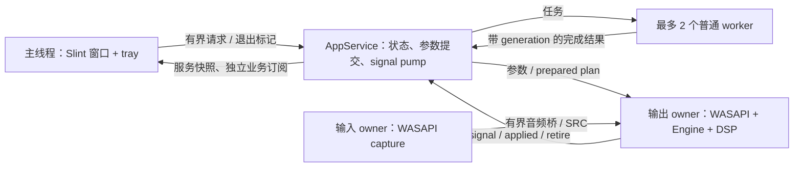

# 应用运行时、线程与所有权设计

日期：2026-10-10。状态：用户已确认整体线程架构；本文件补齐实施边界与生命周期规则。

## 1. 交付目标与边界

把已有 Slint 原型、Tone/Monitor 后端、参数控制和通用信号总线组合为一个运行时。窗口、托盘和音频会话各自有明确的生命周期；UI 不承担阻塞设备操作；RT 不依赖 UI 或普通任务的调度。

本次交付真实设备目录、物理/进程监听和测试音播放的现有功能接入、参数提交、托盘隐藏与恢复、显式退出、按可见性订阅的逐声道电平，以及通用信号 API/内部状态示例。沿用现有设备格式限制，不扩展音频格式和路由产品功能。

不创建 parameter crate、command 抽象、async runtime、独立 signal 分发线程或独立 tray 线程。本次不实现自动登录启动、配置持久化、IPC 服务、录音、插件宿主、多输入/多输出及自动故障重连。这些功能的落点在第 8 节说明。

## 2. 线程与职责

| 执行位置 | 数量 | 持有的状态及责任 | 跨界通路 |
| --- | --- | --- | --- |
| 主/UI 线程 | 1 | Slint 主窗、SystemTrayIcon、属性/model、输入、展示状态、可见性 | 请求 AppService；读取服务快照及服务建立的业务订阅 |
| AppService | 1 | 期望配置、逻辑图、会话实际状态、ControlPort、PlanControlPort、signal 目录与 pump、任务调度 | 有界 UI 请求、worker 结果、RT 控制/回复、预分配信号通道 |
| 输出 owner | 每个独立输出时钟域 1 | WASAPI/COM、Engine、参数应用/ramp、DSP、当前 signal 发布权限 | 音频事件驱动；固定音频桥、控制与退场队列 |
| 输入 owner | 每个启用捕获流按后端需要 1 | WASAPI/COM、capture ingress、原生时钟与取消 | 固定音频桥与标量状态 |
| 普通任务 worker | 最多 2 | 编图/准备、目录枚举、启动握手等待、阻塞 join、DSP 大对象析构 | 每个 worker 的有界任务队列；有界结果队列 |

单输入、单输出时是 4 个核心线程，外加最多 2 个任务 worker；Windows、驱动和库内部线程另计。worker 只执行有限任务，不用于常驻 telemetry、后台 join 轮询或持续录音循环。

箭头表示通信，不要求统一成一个消息系统。音频样本、已接受参数、PreparedPlan 所有权和可丢失观测分别使用适合自身语义的通路。

## 3. 状态归属与请求

AppService 是期望会话配置、当前图及后端实际状态的唯一写入者。UI 保存选中页面、编辑中的控件值、滚动位置和窗口展示状态；按钮不能通过翻转本地 running 模拟启动成功。

UI 与 tray 共用 AppHandle。普通请求队列默认容量 64，使用 try_send，不阻塞 UI。满队列明确返回 Busy；滑杆尚未被 engine 接受的期望值允许合并，已经 Accepted 的参数请求不能覆盖或丢弃。用户请求 ID、配置 generation、图 revision、timeline epoch 分开记录。

退出使用独立的原子标记并唤醒 AppService，不能因普通请求队列满而丢失。关闭主窗默认隐藏到托盘，仍运行会话；托盘“退出”才进入退出状态。操作系统关机/会话结束也进入同一停止流程，尽力完成已允许的清理时间，不引入强杀线程。

服务快照只保留最新完整版本；UI 卡住时不会累计无界 Slint callback。主线程定时读取快照，并分别更新窗口和 tray 的实例。信号数据由独立业务订阅读取，不装进一份不断扩大的通用 AppSnapshot。

## 4. 会话状态、准备与取消

单个输出时钟域的状态为 `Idle → Starting → Running → Stopping → Idle`，失败进入 `Failed`；应用另有 `Exiting → Exited`。第一版 GUI 同时运行一个监听或测试音会话。已有 CLI 保留自身的调用和报告模式。

每次改变启动配置或停止都推进 session generation。worker 结果携带提交时的 generation，AppService 只接纳与当前期望一致的结果。

启动分两阶段：worker 准备 capture、图、render 和 owner 握手；两个 owner 等同一个 activation gate，尚不 Start 捕获/播放或运行 DSP。AppService 校验 generation 后才激活 gate，两个 owner 从各自观察 Start 起计算运行时长。过期结果交给清理 worker，关闭 gate 并停止/join 两个 owner；不能短暂播放一个早已取消的会话。激活后的 Started/Failed 标量确认决定实际 Running 状态，不把线程 spawn 成功当作设备启动成功。

取消 token 在派发任务前准备，既能中断进程 loopback activation，也能中断准备后的 gate。更改设备时先停止旧会话并完成回收，再启用新会话；同一会话中的 compatible graph swap 继续在 RT 块边界原子交接，不重建已有 Topic。

GUI 持续监听使用显式 `SessionDuration::UntilStopped`；限时使用 `SessionDuration::For(Duration)`。现有 CLI 的 1..=600 秒校验保留，不通过超大 Duration 或反复自动重启来模拟持续运行。报告中的 requested_seconds 对无限时长用 Option 表达，并提升受影响的报告 schema 版本。

失败保存可展示的原因和最后一次报告。设备失效/进程退出停止同一会话的另一端，服务不会自动换成默认设备或另一 PID。重试由显式用户请求触发。

## 5. 停止、退出与析构

request_stop 只发送停止信号。MonitorSession、RenderSession、CaptureSession 的现有 join 和加入 Drop 均可能阻塞；会话 owner 只能转移给清理 worker，禁止在 UI 或 AppService 循环中直接 drop 它们。停止后仍须终结已 Accepted 的参数：join 返回 renderer 所有权，worker 排空已有 Applied、将未应用事件按退役 runtime 回复 StaleRevision，最终结果交还 service ledger；不能先 drop Engine 静默丢请求。

退出步骤：拒绝新启动及参数请求；撤销 UI 业务需求；取消全部准备任务；信号所有活动会话；把 session join 与 retire 对象移给 worker；继续有界排空 applied/retire 和任务结果；所有 owner 和任务资源回收后发布 Exited，主线程调用 quit_event_loop。UI 线程只在收到 Exited 后 join 已完成的 service；异常 GUI 退出也先触发取消再进行非 RT 清理。

原生 COM/设备接口仍在原 owner 上停止并释放；它们不能转给普通 worker。Engine、processor、signal endpoint 和预备图等纯 Rust 大对象在停止后随 owner 返回给 join/cleanup 路径，或经 retire 队列转交非 RT 回收。服务目录的保活根在所有 RT host、候选和 retired 引用释放前一直存在，避免 UI 先退出造成 RT 最后引用析构。

worker 调度保留清理能力：最多一个 preparing/enumerating 任务同时运行，另一 worker 优先处理 stop/join/retire。任务队列容量各 1、完成队列容量 8，service 暂存工作项上限 16。结果交接失败时 worker 自行停止/清理其拥有的结果，不把含 JoinHandle 的结果丢在服务或 UI 上。超过上限的新请求返回 Busy，不建立无界待清理列表。

## 6. AppService 循环预算

每轮优先退出/取消、owner 状态、applied 回复和退场，之后处理至多 16 个 UI 请求、8 个任务结果、32 个 applied 回复及 8 个 retire 项；signal pump 放在最后。

默认 signal 轮询间隔 5 ms，pump 限制 32 次 Topic 检查、64 个交付操作和 256 KiB 复制；若单份负载更大，依据 pump 的 required_copy_bytes 为下一轮选择足够的有界预算，默认单消息复制布局上限 1 MiB，准备时校验。持续请求不能饿死 owner 退场；大量订阅不能把一次 pump 变成无界 fan-out。

无业务需求时停止 telemetry 轮询。无会话、任务、请求及管理工作时 park，UI 请求/worker 完成从非 RT 唤醒；运行会话时最多每 10 ms 检查 owner 状态/applied/retire。RT 只写预分配队列或原子，不主动唤醒 service、Slint 或通用 executor。

## 7. UI、tray 与展示需求

使用当前 Slint 1.18.1 的 SystemTrayIcon，与 MainWindow 共用主事件循环。窗口 close callback 返回 KeepWindowShown，同时由 Rust 隐藏窗口并释放展示订阅；恢复 show、取消 minimized，再请求当前服务快照。事件循环使用 run_event_loop_until_quit，以显式清理完成控制退出。

每个 root component 的 Slint global 各有自己的实例。Rust adapter 必须把服务状态分别送给主窗与 tray，不能把 Slint global 视为全应用共享的后端状态。[SystemTrayIcon 文档](https://docs.slint.dev/latest/docs/slint/reference/window/systemtrayicon/)

UI 只向 AppService 请求建立/撤销业务订阅，读取 service 返回的独立订阅端。页面展示、控件 visible、viewport 相交且窗口 visible && !minimized 才持有订阅；33 ms UI timer 读取窗口状态、快照与订阅。进入隐藏/切页/销毁立即撤销；OS 最小化由下一次 timer 同步，最多一轮 UI timer 延迟，不依赖其它程序的遮挡检测。不可见时停止数据刷新，但保留必要的轻量窗口状态观察以发现恢复。窗口销毁通过展示 token 的 Drop 撤销，服务保有撤销后端，不触碰 Slint 对象。

同一控件两次绘制之间保持订阅。所有用户退订后恢复需要新 activation generation，不能显示暂停前缓存；其他分析订阅存在时仍继续生产。用户拖慢或长时间借用自己的读槽只影响自身。

保留现有主题、布局与图标。设备列表改为真实长度的 model，空列表禁用启动并解释；不能继续硬编码取 Mock.outputs[0..3]。未经后端确认，按钮显示 Starting/Stopping，不声称 Running。

## 8. 后续能力的落点

| 能力 | 归属 | 新线程的条件 |
| --- | --- | --- |
| 热插拔/睡眠恢复 | OS callback 仅投递或合并事件；service 决策、worker 重枚举/准备 | 沿用现有事件来源；仅在原平台要求独立 loop 时增加平台 owner |
| 配置/预设/日志文件 | service 持有语义状态；worker 批量读写 | 小量有限任务沿用 pool |
| IPC/网络控制 | 非 RT I/O 接入同一 service 请求与回复 | 确有常驻 I/O 时建立 I/O task/owner，不占住普通任务 pool |
| 录音 | RT 到预分配音频队列，独立非 RT 写盘任务 | 持续写盘需要常驻 I/O 执行位置 |
| 离线导出/分析 | 可取消且有界的 worker 任务 | 与实时音频独立限额，避免抢占所有 worker |
| 插件 | worker 加载/准备；UI 上编辑器；RT 上处理 | 隔离进程仅在明确沙箱/故障隔离要求时引入 |

模块边界不自动对应新线程。参数属于 engine 的领域模块，signal 是不创建线程的通信库，tray 是主线程的一种界面。

## 9. 验收与计划

- 无音频硬件测试状态机、过期完成、取消、退出和 worker 回收；真实硬件另外验证启动/停止/设备失效。
- UI 暂停更新期间后端持续推进；主窗隐藏及销毁后音频存活，tray 与新主窗恢复到同一后端状态。
- 填满请求或观测队列，退出仍能到达；满 applied/retire 通道的现有保护不回归。
- allocator 计数覆盖 RT signal 正常、满容量、需求改变、换图及消费者退出；DSP/endpoint 析构线程通过所有权测试确认。
- 每份 plan 的接口与测试文件固定，按 [整体实施顺序](../plans/2026-10-10-application-and-signal.md) 执行。
