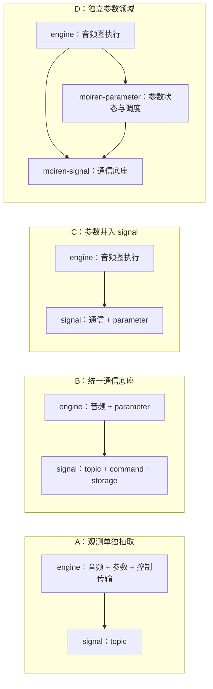
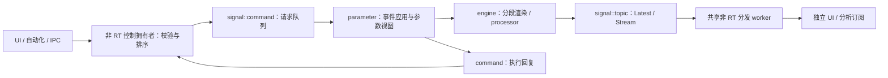

# RT → 非 RT 通用信号总线设计

日期：2026-10-10。状态：信号契约与整体线程架构已确认；实施计划已编写，尚未开始代码实施。

## 1. 目标与已确认的约束

实现通用的 RT → 非 RT 信号总线。电平、波形、压缩器内部的增益衰减量都是使用者；新增数据结构不要求修改总线的数据种类枚举。

已经确认：

- 音频观察位置按任意节点的输出端口订阅。
- 信号来源也包括 processor 内部状态，例如压缩量。
- 同时提供 Latest 和 Stream 两种交付语义，用户已在逐项讨论中确认。
- 创建 Topic 时固定为 Latest 或 Stream，订阅者使用该 Topic 的交付语义。只需要 Latest 时仅准备和发布 Latest；确需两种语义时分别创建 Topic。用户已在逐项讨论中确认。
- 同一信号支持不同线程上的独立订阅者，各自读取，用户已在逐项讨论中确认。
- 每个 Topic 只允许一个有效发布绑定；Topic、发布通道与缓冲区独立于图的生命周期，可以跨图复用，消费者订阅逻辑 Topic。换图不清理缓冲或要求重新订阅。用户已在逐项讨论中确认。
- 唯一发布端由稳定的 RT 宿主持有，processor 使用预绑定的类型安全句柄，并须取得宿主授予的有效发布权限才能访问通道。候选图只能准备绑定，块边界激活后才能发布；发布端不随 processor 对象复制或销毁。用户已在逐项讨论中确认。
- 第一版跨图复用及发布绑定交接限定在同一 RT 线程内，在处理块边界交接；不同 Engine/RT 线程之间的发布绑定迁移不属于第一版范围。用户已在逐项讨论中确认。
- 音频时间信息由各信号类型按需携带，总线不强制所有消息附带 epoch、plan revision、帧区间或采样率。总线负责 Topic 身份、发布序号与丢弃等通用传输信息。用户已在逐项讨论中确认。
- Topic 按调用方指定的稳定名称注册与查找，注册和订阅端可以分别按名称解析同一 Topic。名称跨图保持稳定，类型检查及名称解析在非 RT 侧完成，RT 只使用准备好的类型安全句柄。用户已在逐项讨论中确认。
- 先注册 Topic，再订阅。注册确定名称、类型、交付模式与容量；发布者可以稍后绑定。已注册但没有发布者的 Topic 可以被订阅并等待数据，订阅不存在的名称返回 NotFound，不保留待注册的订阅。用户已在逐项讨论中确认。
- Topic 由控制层显式注销。没有发布绑定、预备图引用和订阅者时仍保留注册身份与缓冲区，持续计入内存预算；最后一个使用者退出不会自动回收 Topic。用户已在逐项讨论中确认。
- 显式注销时，若 Topic 仍有发布绑定或被运行图、候选图及尚未退场的计划引用，返回 Busy，并保持原有注册、需求与交付状态。调用方解除绑定并释放相关计划引用后再重试；成功注销使已有订阅收到 Closed，内存只在非 RT 侧回收。用户已在逐项讨论中确认。
- 来源实际解除绑定但 Topic 仍注册时，保留 Latest 最后快照以及已有 Stream 订阅中尚未消费的数据，并额外暴露 NoPublisher 状态；之后重新绑定沿用 Topic 的序号。全体业务需求归零后的恢复仍遵守新的启用区间规则。用户已在逐项讨论中确认。
- Topic 不存在、类型不匹配、发布绑定冲突或其他无效信号绑定导致整个候选计划在准备阶段失败，当前图继续运行；不通过跳过失败信号的方式部分接入。用户已在逐项讨论中确认。
- 第一版负载支持可复制的值或自定义结构体，以及准备阶段预分配的固定容量元素块；元素块的有效长度可变。负载不直接包含 Vec、String 等拥有堆内存的对象。用户已在逐项讨论中确认。
- 注册时提供初始化值或初始化工厂，在非 RT 侧安全初始化全部槽，不额外要求负载或自定义头部实现 Default。占位内容在首次实际发布前不是有效消息。用户已在逐项讨论中确认。
- RT 数据块支持借用预分配写槽、原地填写自定义头部与元素、提交有效长度，并提供从已有 slice 复制发布的便利方法。未提交就结束写入借用时不产生消息、不释放堆内存。单值直接发布值。用户已在逐项讨论中确认。
- 订阅端数据块提供只读借用 guard 和复制到调用方缓冲区的便利方法，单值返回副本。借用占用该订阅者自己的槽，不占用 RT 发布槽；长时间持有只影响自身交付，不阻塞其他订阅者或 RT。用户已在逐项讨论中确认。
- Topic 已处于持续观测状态时，新 Latest 订阅可以取得当前完整快照，新 Stream 订阅只接收订阅生效后发布的数据，不重放历史；此前所有业务订阅退出后，两种模式恢复时均等待新数据。用户已在逐项讨论中确认。
- 每个 Stream 订阅可独立配置有界队列容量，并提供默认值。资源在非 RT 订阅阶段分配，计入总线预算；预算不足时订阅失败，不能改变 RT 发布通道的容量或增加 RT 扩容工作。用户已在逐项讨论中确认。
- Stream 满容量时丢弃本次新数据，立即返回，不淘汰已入队数据；通过序号与丢弃计数暴露缺口。用户已在逐项讨论中确认。
- 统计分层报告 RT 传输队列丢弃和各订阅者队列丢弃，订阅端保留原始发布序号。Latest 跳过中间版本通过序号体现，与 Stream 满队列丢弃区分。用户已在逐项讨论中确认。
- Topic 无任何订阅者时跳过额外观测计算与发布，保留准备好的存储。UI 不参与展示的信号组件不持有订阅；用户特别要求订阅随 UI 的渲染需求变化。用户已在逐项讨论中确认。
- RT 生产者查询需求状态及启用代次，在块边界发现代次变化后自行重置观察窗口；总线用对应代次隔离旧启用区间数据，不注册额外的启用/停用 RT 回调。兼容换图不改变启用代次，正常 DSP 状态不因观察需求重置。用户已在逐项讨论中确认。
- 第一版 UI 需求跟踪应用内可见性：页面切换、组件隐藏或销毁、移出可见视口、窗口隐藏或最小化时释放相应订阅。其他应用窗口的遮挡检测不属于第一版范围。用户已在逐项讨论中确认。
- 采集窗口、聚合方式与发布时机由信号生产者控制；总线提供订阅需求状态与传输能力，不统一节流。UI 刷新频率独立设置。用户已在逐项讨论中确认。
- 总线提供调用方驱动的有界 pump；应用层用一个共享的普通非 RT 线程为所有 Topic 分发。总线核心不自行创建线程，第一版不引入 async runtime。无业务订阅者时停止数据轮询，阻塞控制操作不直接占用分发循环。用户已在逐项讨论中确认。
- 总线放入独立的 moiren-signal crate，不依赖 Engine、音频采样类型或 Slint；engine 层负责图绑定，app 层负责 UI 适配。用户已在逐项讨论中确认。
- Latest、Stream、单值和数据块在 Rust 类型上区分，提供与各自语义对应的读取接口；名称解析后的类型和模式检查仍在非 RT 侧完成。用户已在逐项讨论中确认。
- processor 和 observer 通过独立的 signals 参数取得仅限当前调用的发布权限，权限不能复制或带出调用；ProcessContext 继续作为可复制的时间信息。用户已在逐项讨论中确认。
- 极力避免 RT 内部 malloc 和 resize。本方案进一步要求总线的 RT 路径零分配、零扩容、零堆内存释放。

类型安全通过 `PublisherHandle<LatestValue<GainReduction>>` 等句柄表达：只能在当前 `ProcessSignals` 权限内发布对应类型；波形和其他状态使用各自的数据结构。最终接口与边界规则见第 14 节和实施计划 B。

## 2. 当前实现与接入位置

- `moiren-engine/src/meter.rs` 已有只读 LevelMeter 和 rtrb 队列。当前快照聚合所有声道；满队列丢新快照，UI 恢复读取时可能取得旧状态。
- `RtObserver` 只获得只读音频输入，适合作为端口观察器。compiler 当前没有为逻辑输出端口安装任意 observer 的公开接口。
- `Compressor` 已保存实际的 `reduction_db`，可以在 DSP 更新后发布，无需从输入输出幅度推算。
- `ProcessContext` 已有 epoch、帧位置、帧数和采样率，音频信号可以按需使用；通用总线不要求为所有消息扩充音频时间戳或 plan revision。
- Slint 的电平来自 mock 或控件值，尚未读取运行中的 Engine。现有 Tone/Monitor 准备和 Windows 会话 API 可用于接入。
- ExecutionPlan 已支持块边界切换、processor 复用和非 RT retire。信号生命周期必须遵守同一所有权边界。

## 3. 方案比较

| 方案 | 数据扩展方式 | 代价与适用边界 |
| --- | --- | --- |
| 每个信号使用有类型的预分配通道，非 RT 统一管理 | 调用方定义结构体，准备阶段取得发布句柄 | 推荐；RT 不查注册表，状态与数据流可以分别选择传输语义 |
| 所有信号共用带类型标签的字节队列 | 注册编码格式，逐条编码、解码 | 需要处理对齐、长度、格式和公共队列拥塞；增加 RT 编码工作 |
| 每个字段使用原子变量 | 按字段增加原子存储 | 适合独立计数器；难以提供任意复合数据及一致的元数据快照 |

推荐第一种。总线负责注册、传输、订阅、生命周期；信号使用者负责测量、降采样及含义。电平的 RMS、波形的 min/max、压缩量的窗口最大值均属于使用者逻辑。

采集窗口、聚合方式与发布时机由生产者控制，这一点已经确认。总线不统一节流或合并负载；生产者先检查观测需求，再执行自己的测量、窗口积累和发布策略。可以提供共用的帧计数或发布节奏辅助工具，但业务语义仍由生产者定义。UI 的刷新频率与生产者的发布频率相互独立。

## 4. 数据与容量契约

第一版已确认提供两种负载形式，以下 Rust trait 约束为对应的接口建议：

1. `T: Copy + Send + Sync + 'static` 的值，例如浮点数、自定义状态结构体或固定数组。
2. 固定容量的 `T` 元素槽，例如一组声道电平、一块采样或 min/max 记录。准备时分配存储；每次发布指定有效元素数，长度不超过容量。

第二种形式通过受限的 slice 写入入口更新已有空间。支持借用预分配写槽、原地填写、再提交有效长度，这是已确认的发布方式；自定义业务头部与元素在一次提交中发布。另提供从已有 slice 复制发布的便利方法。RT 不拥有可 resize 的 Vec，也不通过替换 Box 交付每条数据；单值入口直接发布值，底层可使用容量为一的槽。

写槽借用是对发布端当前槽的独占访问，提交前消费者不可见。未提交就结束借用时仅放弃本次发布，上一份已发布数据保持完整；写入借用只携带引用及必要的索引，不拥有会在 RT 上释放的堆资源。槽的初始化和总存储分配在准备阶段完成，安全接口不能把尚未初始化的元素暴露为有效的 T。入口为 BlockInit/初始化工厂与 BlockWriteGuard，见实施计划 B。

初始化方式已经确认：注册时接受有效的初始化值或工厂，在非 RT 侧完成头部和元素槽的初始化，不要求额外的 Default trait。初始化不能通过把任意 Copy 类型的内存清零来实现；含枚举或非零类型的自定义结构也必须保持有效。单独的已发布标记区分占位内容与真实消息，未发布时订阅端返回无数据。

这允许调用方定义自己的数据结构和布局。可变长度内容必须有准备阶段声明的上界，超过上界返回明确错误，保留上一条有效快照；音频处理继续运行。

通道创建时校验容量、大小乘法溢出和存储预算。实际槽数及元数据、负载、传输队列的存储都计入通道预算。总线汇总预算后才能接收新的注册。

预算也覆盖非 RT 分发到各业务订阅者的独立存储。Stream 订阅在非 RT 侧指定自身的有界队列容量，省略时使用默认值；订阅时校验槽数、数据大小及总预算，失败不能建立业务需求。订阅端队列容量独立于 Topic 的 RT 传输容量，扩大一个订阅者的队列不改变其他订阅者或 RT 端的存储。读取借用占用的槽也须计入容量及预算，不能另建无界待回收列表。

总线目录保存稳定的 Topic 身份与本次注册的 generation，兼容的图切换沿用该身份和 generation。一个发布槽维护通用传输信息：

- 发布 sequence、有效元素数；
- 与上述信息一起发布的负载；
- 数据块自定义业务头部通过 BlockWriteGuard::header_mut 写入，头部与有效元素在同一次 commit 中提交。

音频时间戳属于业务数据格式。压缩量可以直接使用 f32；波形、RMS 窗口等信号按需携带 timeline epoch、帧区间、采样率或 plan revision，也可以共用业务侧的时间戳结构。总线不解释这些字段、不把它们作为通用过滤条件。

所有字段来自同一次发布。若使用业务头部，订阅者不能把不同发布的帧位置、声道信息和元素拼成一个快照。sequence 的缺口使覆盖或丢弃可观察。

sequence 在值发布、合法 commit 或满容量申请时递增，包含因 Stream 满容量而未入队的尝试；取得写槽后主动放弃、非法长度和无需求不递增。这样下一条成功发布能显示丢弃缺口。独立累计丢弃统计在来源关闭时仍可读取，避免最后一次丢弃后没有后续数据而无法观察。

统计按传输层次区分，这一方向已经确认。TopicStats 记录 attempts/ingress_drops；SubscriberStats 记录 delivered/overflow_drops。dispatcher 不重新编号，所有订阅者保留同一发布的原始 sequence。Latest 按其语义跳过中间版本，通过 sequence 缺口反映，不记为 Stream 容量丢弃；不能把以上情况混成一个无法定位的计数。字段和边界见实施计划 B2–B4。

## 5. 两种交付语义

### Latest：读取最新状态

用于电平、压缩量及普通状态。

- 使用预分配的三个槽，使 producer、已发布槽、consumer 各自拥有独立空间。
- RT 原地填充自己的槽并发布；consumer 尚未读取的旧发布允许被更新的发布替换。
- 一次发布或读取只做有界操作，不等待其他线程，也不追赶一个不断产生数据的 producer。
- UI 暂停后取得最新完整快照，sequence 能说明跳过了多少次发布。
- 普通最新值不保证保存中间的瞬时峰值。需要峰值保持、累计次数或窗口极值的 producer 在自己的负载中明确表达，不能靠增加队列长度代替。

采用成熟的 triple buffer 实现作为底层，写入时使用已有负载空间；不会逐次创建或替换含堆内存的快照。

### Stream：按顺序读取数据块

用于波形片段、分析窗口或需要顺序的数据。

- 固定数量的负载槽在 RT 和非 RT 之间循环使用；空闲槽和已发布槽通过有界 SPSC 队列移交。
- producer 保有准备好的写入空间；满队列或没有空闲槽时立即报告丢弃，本次数据不进入队列。满容量丢新数据已经确认，不允许覆盖或淘汰已入队数据。
- 传输缺口由 sequence 和丢弃统计表达。音频信号还可以在自身格式中携带帧区间，consumer 按帧位置绘制缺口或重置业务历史。
- consumer 每轮读取数量有明确上限，不能通过无界排空追逐 producer。
- 慢 consumer 不改变音频处理的进度。该语义提供有界、可观测的丢失，不承诺无限历史或无损录音。

每个 Topic 在注册时固定一种交付语义，订阅者沿用该语义。Latest Topic 仅准备 Latest 存储、仅执行 Latest 发布，不隐式分配 Stream 队列，也不额外发布 Stream。确实需要两种语义时，来源分别注册两个 Topic，可复用同一次业务测量结果，分别发布；两者的存储预算和发布频率独立配置。

订阅动作不得使 RT 扩容、分配或增加随订阅者数量增长的发布工作。RT 只检查预先准备的需求状态，决定是否执行观测与发布。不同订阅者可各自设置非 RT 侧的消费预算；这不改变 Topic 的 RT 传输语义。

## 6. 非 RT 注册与订阅

Topic 的对外身份采用调用方指定的稳定路径名，例如：

- `source/main/output/level`；
- `source/main/output/waveform`；
- `compressor/main/gain_reduction`；
- `engine/status`。

调用方负责让名称表示稳定的逻辑信号，不从 plan revision 或短期 processor 实例编号生成身份。音频端口及节点信息可以作为图绑定或目录的关联元数据，通用总线不依赖 NodeId/PortId 定义主键。总线实例的命名空间隔离不同目录；名称解析成内部 ID 和类型安全句柄后再进入 RT。

目录保存信号名称、类型、单位说明、交付语义、容量和 generation。内部 processor 编号、BufferSlot 编号和指针都不是 UI 信号身份。独立模块可以按相同名称找到同一 Topic；类型不匹配返回明确错误。

注册、名称查找、类型检查、订阅和取消订阅均发生在非 RT。类型不匹配、重复注册和容量错误在进入 RT 前返回。

订阅要求 Topic 已注册，这一顺序已经确认。注册与发布者绑定是两个独立操作：注册时准备名称、类型、交付模式及容量，尚无发布者时也允许订阅。此时订阅有效，但未发布过数据时不能把用于初始化槽的值当作真实消息。订阅不存在的名称返回 NotFound；总线不维护等待未来注册的订阅。之后绑定发布者不要求已有订阅重建。

processor 只持有准备好的 `PublisherHandle<P>`，通过当前 ProcessSignals 直接访问已绑定通道，不做名称查找、Any downcast、HashMap 查询、序列化或 UI callback。

唯一发布端由稳定的 RT 宿主持有，processor 只持预绑定的类型安全访问句柄，这一所有权方向已经确认。句柄本身不授予独立可写能力：实际发布还需要宿主限定到当前有效绑定的权限，候选图不能通过构造或复制一个访问句柄就取得发布权。底层 SPSC producer 与可变传输状态不克隆给多个 Engine 或 processor；通用总线提供 RtHost/SignalScope/PreparedHostUpdate，图绑定适配在 engine 层完成。权限及宿主资源表见实施计划 B5/C1/C3。

每个 Topic 只有一个有效发布绑定，这是已确认的业务契约。Topic 与其缓冲区独立于图；不同计划引用同一已注册 Topic 时复用同一发布通道，不能创建第二个同时有效的发布绑定。消费者订阅逻辑 Topic，不需要关心当前由哪个 processor 实例发布。新的独立发布绑定与现有绑定冲突时必须报错。第一版只允许同一 RT 线程内的跨图复用，处理块边界完成绑定交接；跨 RT 线程迁移不属于第一版范围。

每条底层传输通道只有一个 RT publisher 和一个传输 consumer。非 RT dispatcher 消费传输后向多个订阅者分发；多个 UI 视图不能克隆底层 SPSC consumer。订阅者独立退出或消费缓慢不会阻塞 dispatcher。

订阅端的数据块读取提供只读 guard 和复制到调用方缓冲区的便利方法，单值直接复制返回，这一 API 方向已经确认。dispatcher 先把负载复制到各订阅者自身的预分配存储，再提供只读借用；读取借用不会延长 RT 发布槽的占用时间，不承诺从 RT 到 UI 全程零复制。借用期间，头部、有效长度及元素保持来自同一条完整消息；该订阅者长期持有 guard 时只影响自身交付，不能阻塞 dispatcher 对其他订阅者的分发。释放 guard 在非 RT 侧归还槽，具体 Rust 类型和借用期限入口在接口设计中确定。

新订阅的起始语义已经确认：Topic 保持持续观测时，Latest 可以提供当前完整快照，Stream 只交付订阅生效后发布的数据，不保留额外重放历史。对 Stream，RT 到 dispatcher 的已有积压不能仅因尚未分发就被当作新订阅后的数据；订阅生效边界与发布序号须有明确协议。若所有业务需求曾归零，则沿用下面的启用区间规则，两种模式均等到新的启用区间数据，不暴露暂停前的缓存。

执行宿主已经确认：应用层提供一个共享的普通非 RT 分发线程，第一版不引入 async runtime。引入独立分发线程与引入 async runtime 是两个选择：前者隔离 UI 和路由的执行进度，后者提供异步等待与任务调度，并不直接减少内存复制或测量成本。

总线实现为由调用方驱动的非 RT `pump(budget)`，核心不自行启动线程、不依赖 Slint 或 Tokio，这一执行边界已确认。一次 pump 限制处理的数据量与消息数，各 Topic 轮转推进，避免单一高流量 Topic 独占分发。应用层为所有 Topic 提供一个共享的非 RT 执行线程；未来可以把同一入口挂到其他服务循环或异步宿主。

方案评估：UI 定时器直接驱动 pump 的线程成本最低，但 UI 卡顿会延迟所有订阅者的分发；共享非 RT 线程增加调度、复制和轮询成本，收益是 UI 卡顿时其他订阅者仍能推进，分发工作也不占用 UI 的刷新预算。第一版使用应用层共享的普通线程，具体轮询周期及处理预算属于实现调优参数。无业务订阅者时停止数据轮询，由非 RT 订阅管理事件唤醒宿主。

现有 capture 启动会等待 startup handshake，MonitorSession::join 是同步阻塞等待。把这些调用包装进 UI 上的 Future 不能让调用本身变成非阻塞；分发循环也不能被它们长期占住。长时间控制操作应由有独立执行能力的控制路径处理，不能直接插入有界的 pump。是否采用异步运行时管理控制路径，应独立于 RT 信号传输选择。

RT 继续只访问预分配槽与原子状态，不创建异步任务，不调用 UI 事件队列，也不承担通用异步通知器的唤醒工作。若宿主采用轮询，轮询周期与 UI 刷新周期的等待时间会叠加；这属于实现后的测量与调优项，当前评估不声称已有性能基准结果。

订阅和取消订阅可以在音频运行中完成，它们只改变非 RT 分发关系。增加信号来源、改变其容量或改变观测位置则需要准备资源并通过计划切换安装。

有效的业务订阅者数量决定观测需求。内部 dispatcher 虽然拥有传输 consumer，但不计作业务订阅者，不能因此让来源一直观测。非 RT 更新需求状态，RT 在块边界读取预先准备的原子状态；无人订阅时跳过测量、数据复制与发布。正常音频 DSP 所需的计算仍然执行。

需求查询提供是否启用及本次启用代次，生产者在块边界发现代次变化后自行重置额外观察窗口，这一接口方向已经确认。总线不注册额外的启用/停用 RT 回调。需求从零恢复必须产生新的启用代次，即使退订和恢复都发生在两个 RT 块边界之间，也不能漏掉窗口重启。发布使用当前块取得的代次，总线不把旧代次的积压交给新的启用区间。启用代次独立于 Topic 注册 generation、图 revision 和业务音频 epoch；兼容换图且需求未归零时保持原代次，正常 DSP 状态不因观察需求变化重置。

恢复订阅后等待新数据，不复用暂停前的缓存读数或待处理 Stream 数据。观察窗口应从新的启用区间开始，不能把无人订阅时的间隔算进连续的 RMS 或波形窗口。具体启用代次及切换协议仍是实现设计的一部分。

## 7. Engine 与 compiler 接入

端口观察和 processor 内部发布使用同一个总线 API：

- compiler 接收按输出 PortId 准备的 observer 绑定。
- observer 紧跟对应节点的输出产生操作执行，读取当时的输出。未来加入 slot 复用时仍须在覆写前执行。
- fan-out 不重复测量同一个输出端口；观察行为不创建音频输出，也不修改音频路径。
- compressor 在实际状态更新后，通过准备好的发布句柄输出增益衰减量。
- 自定义 processor 可以持有其他 `PublisherHandle<LatestValue<MyData>>` 或 Stream/块句柄；总线无需知道 MyData 的业务含义。
- processor 和 observer 的调用接口增加独立的 signals 参数，该参数提供本次有效调用的发布访问权限；权限不能复制、跨线程发送或带出调用。ProcessContext 保留可复制的时间信息，不承担发布权限。具体访问对象暂称 ProcessSignals，其 Rust 生命周期、方法及参数顺序在完整 API 草图中确定。
- 音频信号按需从 processor context 取得时间信息，并在自身数据格式中表达；通用发布接口不要求音频 context 或 plan revision。

带业务时间戳的快照只表达自身的时间窗口。不同信号和不同线程发布的快照不承诺构成跨通道原子事务。

## 8. 生命周期与换图

- Topic 生命周期独立于图与 processor 实例，已有订阅面向逻辑 Topic。兼容的图切换沿用 Topic、发布通道、缓冲区、sequence、generation 与订阅，不清空 Latest、不排掉已接收的 Stream，也不重置消费者历史。
- 第一版绑定交接发生在同一 RT 线程的处理块边界，旧图完成发布后新图才能使用该绑定。同一 Topic 的单发布者传输状态持续保留，不支持在两个 RT 线程之间迁移发布权。
- 唯一发布端归稳定的 RT 宿主管理，旧、新 processor 的访问句柄不是两个独立发布者。候选图只准备绑定描述；激活时切换有效访问权限并保留通道状态，旧图退场后无权继续发布。RT 激活所需的资源表及绑定交接表均在非 RT 侧准备。
- 编辑和取消候选计划不改变当前 Topic 数据。候选只引用准备好的绑定配置，实际激活必须遵守唯一发布绑定的协议；候选未激活时不能发布，旧计划退场不能把仍被新计划使用的 Topic 关闭。
- 如果业务格式携带 plan revision，它记录这份数据的实际来源。dispatcher 不解释或重写业务时间字段，不因 revision 改变而丢弃同一 Topic 的已发布数据。新计划首次发布前，Latest 仍返回上一份完整快照及其原有数据。
- 无论是否复用整个 processor，只要 Topic 契约兼容，便沿用该 Topic 的通道与存储。Topic 传输的延续独立于 DSP 内部状态的继承；后者由 processor 复用契约控制。
- prepare 阶段校验 Topic 的逻辑身份、负载类型、容量和交付语义，不兼容时返回明确错误。信号绑定描述纳入计划验证；使用 `with_reuse` 时还要保证候选的映射和 snapshot 反映实际保留的绑定。所有映射和交接资源在控制侧准备，RT 激活不分配、不扩容。
- 无效信号绑定拒绝整个候选计划，这一失败策略已经确认；包括 Topic 不存在、类型不匹配、发布绑定冲突及不兼容配置，不跳过错误绑定后继续部分激活。准备失败或块边界激活被拒绝时，当前图及其有效信号绑定保持原样。
- processor 实例重建或内部编号变化不产生新的 Topic generation。只有实际注销、重新注册 Topic 或不兼容的契约替换才需要新的注册代次。传输缺口由 sequence 和丢弃信息表达；音频信号的 timeline epoch 变化由业务数据表达并交给对应消费者处理，不能把每次换图都视为断流。
- 暂无发布者与 Topic 注销是不同状态。图中的来源退出不自动销毁可跨图复用的 Topic；即使没有发布绑定、预备图引用和订阅者，目录与缓冲也保留到控制层显式注销，并继续占用预算。这一回收策略已确认。Topic 真正注销时订阅得到 Closed，同名重新注册取得新的注册代次。
- 来源真正解除绑定而 Topic 仍注册时，暴露 NoPublisher，并保留 Latest 最后快照及已有 Stream 订阅的未消费数据，这一交付行为已经确认。状态与负载分开查询，不能把最后一份快照伪装成持续更新，也不能把来源退出等同于 Topic 注销。之后绑定新来源沿用 sequence；若期间全体需求归零，则仍须等待新的启用区间数据，不能绕过暂停规则。
- 显式注销在 Topic 仍有发布绑定，或运行图、候选图、尚未退场的计划仍引用它时返回 Busy，这一行为已经确认。失败不改变注册、订阅需求或数据交付，也不进入待关闭状态。调用方先解除绑定并释放相关计划引用，再重试；检查与注销须在控制侧协调，不能与新引用建立产生竞态。已有业务订阅本身不导致 Busy，成功注销时它们收到 Closed；订阅端已持有的只读借用仍须遵守其资源生命周期，存储只有在没有可访问引用后才能在非 RT 侧释放。
- 通道存储归 Topic 资源生命周期管理，旧计划 retire 不负责销毁仍在使用的通道。最终注销、候选和旧计划销毁均在控制侧完成。UI 先退出、取消订阅、满队列和停止场景都不允许在音频 callback 上触发堆内存释放。
- 信号身份、类型或容量不兼容时重新准备通道，不能把不兼容的槽当作可复用资源。

## 9. UI 数据流

```text
Engine / processor / 输出端口 observer
    → 预绑定 PublisherHandle<P> + 当前 ProcessSignals 权限
    → Latest 槽或 Stream 槽池
    → 非 RT dispatcher
    → 有类型的订阅快照
    → Slint UI 线程上的属性或 model 更新
```

UI 使用定时刷新读取已有订阅结果；刷新频率与音频 block 数无关。默认可按约 30 Hz 刷新，测量和发布频率由各信号来源单独设置。

UI adapter 负责根据组件持续的可见展示状态持有和释放订阅句柄。处于展示状态的组件在两次绘制之间继续持有订阅，信号更新才能驱动下一次刷新。页面切换、组件隐藏或销毁、移出可见视口、窗口隐藏或最小化时释放相应订阅；恢复展示时重新订阅并等待新数据。这些应用内可见性场景已经确认，第一版不接入其他应用窗口的遮挡检测。

UI 退订只移除自身需求；若分析器等其他消费者仍然订阅，Topic 继续观测。没有任何组件展示时停止 UI 的信号刷新任务；音频处理及其他消费者仍可运行。

设备启动、停止和 join 在控制侧进行。RT 不调 Slint，不向 UI 逐 block 投递 callback。慢窗口、隐藏页面和多个视图不会形成音频背压。

首批接入：

- 真实运行图的输出端口电平，每声道 peak/RMS；UI 更新来自 Engine 发布的数据。
- compressor 实际 gain reduction，验证内部状态能走相同总线。
- 自定义数据结构和预分配数据块的示例，验证类型扩展不需要改总线枚举。

波形数据块的传输能力属于总线验收。波形的测量方式和专用绘制界面可以由后续使用者选择，本方案不把总线接口绑定为 min/max 波形接口。

## 10. 验收证据

- 自定义结构体、单值和固定容量数据块均可经总线从独立 RT 线程传到非 RT 订阅端。
- 原地写槽与 slice 复制入口均可发布数据块；放弃写入借用或提交非法长度时不会暴露部分写入，也不会改变上一份已发布快照。任意有效 Copy 类型的槽必须在准备侧安全初始化。
- 不实现 Default 的自定义 Copy 类型及业务头部可以通过初始化值或工厂注册；含非零值或枚举的类型不被无效清零，槽初始占位在首次发布前不可作为消息读取。
- 类型不匹配、重复注册、错误容量和预算溢出在准备侧失败。
- 订阅未注册的名称返回 NotFound；已注册且从未有发布者的 Topic 可以订阅并等待数据，不返回槽初始化值。发布者随后绑定时已有订阅保持有效。
- Latest 在 consumer 暂停并错过多次发布后提供最新一致快照；中间丢失通过 sequence 可观察。
- Stream 保持成功发布的顺序，满容量时立即返回；恢复消费后能观察帧位置及丢失。
- RT 入口丢弃与各订阅者独立丢弃分别可读，满队列的一个订阅者不改变其他订阅者的数据及统计；所有订阅保留原始发布序号，Latest 跳过中间版本不误报为 Stream 队列溢出。
- 两个 UI 订阅者可同时读取，取消或拖慢一个订阅者不阻塞另一个，也不阻塞 RT。
- 数据块只读借用与复制读取取得一致的头部、有效长度及元素；长时间持有一个订阅者的读取 guard 不占用 RT 发布槽，也不阻塞其他订阅者的交付。
- 新 Latest 订阅在持续观测期间可以读取当前完整快照；新 Stream 订阅不接收订阅生效前发布的 RT 积压，不提供历史重放。全体业务需求归零后的恢复仍等待新启用区间数据。
- 不同 Stream 订阅者可使用不同队列容量，分配均在非 RT 侧计入总预算；预算不足时订阅失败且不建立虚假需求，调整订阅容量不改变 RT 存储或工作量。
- 无业务订阅者时观测回调不执行额外测量与复制，内部 dispatcher 不维持虚假的需求。恢复订阅后只接收新的启用区间数据，暂停前的队列、缓存和累积窗口不可混入。
- 全体退订再恢复即使发生在两个 RT 块之间，也产生可观察的新启用代次并重启额外观察窗口；正常 DSP 继续运行。兼容换图且持续有人订阅时不改变启用代次。
- UI 页面切换、组件隐藏或销毁、移出可见视口、窗口隐藏或最小化会释放相应订阅，恢复展示会重新订阅；UI 退订不影响其他业务订阅者。展示中的组件在两次绘制之间保持订阅，持续信号可驱动后续刷新。
- 每声道电平、变量 block、参数分段和 compressor 内部状态与实际音频及 DSP 状态一致。
- 输出端口观察不改变 fan-out、音频值或音频延迟。
- 单值 Topic 可以只发布 f32，自定义业务时间信息也可随结构体或数据块头部发布；总线不要求音频字段，业务头部与元素必须来自同一次发布。
- 兼容换图及 processor 重建沿用同一 Topic 和实际缓冲区，已有订阅持续有效；generation 与 sequence 不因图切换而重置。换图前入队的 Stream 仍可顺序读取，Latest 在新计划首次发布前仍返回上一份完整快照，业务字段保持原样。
- 取消候选不改变当前信号，旧计划 retire 不关闭新计划正在使用的 Topic；唯一发布绑定在交接中始终成立。Topic 实际注销有对应状态；按需携带 timeline epoch 的音频信号由业务消费者处理时间线变化。
- 候选图仅持预绑定访问句柄，未激活时不能发布；同一稳定 RT 宿主切换发布权限后，旧图句柄不能继续发布。来源实际解绑时已有订阅可观察 NoPublisher 并读取先前完整数据，重新绑定沿用序号。
- Topic 不存在、错误类型、发布冲突及不兼容信号配置拒绝整个候选计划，当前音频图和信号绑定不受影响；块边界拒绝激活时也不留下部分切换的信号。
- 在仍有发布绑定、运行图引用、候选图引用或尚未退场的计划引用时注销返回 Busy，并保留注册和正常数据交付；释放这些引用后可成功注销，现有订阅收到 Closed，旧句柄不能接入同名重新注册的 Topic。
- 复用测试改变 processor 编号，并证明 UI 订阅的是实际保留的 publisher；不兼容类型、容量或传输模式在控制侧失败。
- allocator 计数覆盖正常发布、Latest 覆盖、Stream 满容量、consumer 退出和换图，证明 RT 上零分配和零释放。
- 使用带析构计数的数据槽和线程身份检查，证明槽池及计划在非 RT 上销毁。
- Slint 页面从真实运行的 Engine 读取，停止后清除读数；卡顿恢复不持续展示旧状态。
- 按变更范围完成 workspace 测试、格式检查、Clippy 和 diff 检查，保留工作区已有 UI 改动。

### 已验证的现有引擎基线

2026-10-10 执行 `cargo test --locked -p moiren-engine --test runtime`：26 passed，0 failed。

这些测试覆盖现有的满遥测队列、换图、控制端退出、processor 复用、RT 分配计数及控制线程析构。它们为接入位置和所有权设计提供基线。本文提出的通用信号总线尚未实现，第 10 节中的总线验收需要实施后另行取得证据。

## 11. 设计依据

- rtrb 0.4.0：满队列返回错误，不覆写已有值；固定容量 SPSC，读写立即返回。<https://docs.rs/rtrb/0.4.0/rtrb/>
- triple_buffer：单 producer/consumer 读取最新版本，提供原地修改和显式 publish 的接口。<https://docs.rs/triple_buffer/latest/triple_buffer/>
- Slint 1.18.1：spawn_local 在 Slint 事件循环执行 Future，文档列出与 Tokio 的兼容约束。<https://docs.rs/slint/latest/slint/fn.spawn_local.html>
- Tokio：runtime 区分 current-thread 和 multi-thread；spawn_blocking 仍会使用额外阻塞线程，长期后台循环建议使用专用线程。<https://docs.rs/tokio/latest/tokio/runtime/>；<https://docs.rs/tokio/1.53.2/tokio/task/fn.spawn_blocking.html>

实施入口见 [整体计划](../plans/2026-10-10-application-and-signal.md)。实施过程中若类型与容量契约或交付语义需要变更，应更新本文并说明影响。

## 12. 模块边界与参数下发评估

模块分层已经确认：独立的 moiren-signal 负责通用类型、预分配传输、订阅、预算、状态、调用权限及有界 pump，不依赖 moiren-engine、音频采样类型或 Slint；moiren-engine 组合发布宿主、图绑定、输出观察器和内部状态接入；moiren-app 提供 AppService 分发宿主及 UI 可见性适配。Latest、Stream、单值和数据块通过不同类型表达，名称与签名见第 14 节和实施计划。

参数下发评估已收敛：本次选择观测与参数分别建模。参数继续属于 engine，按职责拆分现有 control 模块；不创建参数线程，也不创建 parameter crate。已有参数请求和回复继续使用现有 rtrb 通道直达 RT，不经过观测 pump。

当前 control.rs 的 ParameterRuntime 同时管理参数表、浮点 ramp、按帧事件消费及回复通道。ControlPort 在非 RT 侧校验值域、plan revision、timeline epoch、时间顺序和调度 horizon。Engine 在每个音频块开始时快照队列可用数量，以 max_events_per_block 限制本块工作，并按事件帧位置切分处理；回复队列满时推迟参数应用，音频仍推进。换图时参数状态及 ramp 仅按明确的兼容复用映射继承，旧队列中的未来事件经 retire 路径回复 StaleRevision。

固定容量的类型安全命令/回复传输、非 RT 分配、容量校验、端点退出状态和非 RT 资源回收具有共用潜力。但现有 rtrb 已经承担主要传输工作，本次不为统一名称额外抽取 command 模块。只有出现第二个有实际复用需求的命令使用者时才单独评估抽取。已接受参数命令的最终结果继续由 engine 保证，不能用 Latest 覆盖或普通 Stream 丢弃；控制通路也不按 UI 可见性停止。

参数值域、ParameterKey 到 prepared slot 的映射、revision/epoch 校验、帧时间排序与 horizon、音频处理分段、FloatRamp 和 ProcessParameters 继续由 engine 管理。直接搬动整个 control.rs 会把音频调度与 graph/protocol 标识带进通用 crate；若改成每个参数一个 Topic，还需重建跨参数事件顺序、单块事件预算和应用确认，扩大回归面。观测 Topic 的跨图连续身份不能替代参数请求的目标版本检查。

抽取传输设施的收益主要是统一预算、资源生命周期和 RT 约束，现有 rtrb 已提供固定容量 SPSC，单纯移文件或增加包装不带来性能收益。模块合并本身不会增加线程或 RT 分配；若把参数命令改走共享观测分发线程，则会增加调度等待并让观测负载影响控制时效，因此当前建议保留直达 RT 的独立控制通路。

## 13. 长期架构方案比较与本次选择

长期按通信能力、参数领域和音频图执行分层。职责边界和 crate 边界分别评估：同一 crate 内仍可严格分层，增加 crate 本身不代表更好的 RT 性能。以下方案保留作为边界比较；本次采用 A 的 crate 边界，同时在 engine 内拆分参数职责。

| 方案 | 改动后的归属 | 主要收益 | 主要成本 |
| --- | --- | --- | --- |
| A：signal 只提供观测 | signal 管理 Topic；engine 保留现有参数通道、状态和调度 | 改动最少，两个接口各自独立 | 观测与控制的预算、生命周期和通道设施分别管理 |
| B：signal 提供通信底座 | signal 分 topic、command 及共用存储设施；engine 内 parameter 管理值域、状态、ramp 和帧调度 | 统一 RT 通信约束，音频领域边界清楚 | engine 内仍包含完整参数领域；需要拆分现有 control.rs 的传输和执行责任 |
| C：参数系统整体进入 signal | signal 内分 transport、topic、command、parameter；engine 负责图和音频执行 | 参数系统可脱离音频引擎复用，集中提供通信和参数能力 | signal 的公共 API 同时承担通信和参数领域，未来参数功能会扩大该 crate 的变化范围 |
| D：独立参数 crate | signal 提供 topic、command 和共用存储；parameter crate 提供参数领域；engine 组合两者执行音频图 | 三层依赖明确，参数领域可单独复用和演进 | 增加 crate，须明确公共类型、适配及版本兼容边界 |

本次不采用 D。独立参数 crate 没有已证实的第二个使用者，当前增加公共接口与适配成本大于收益。B 可以在出现真实命令复用时演进，但不是实施前置条件，也不在本次交付范围。



图中箭头代表代码依赖。所有方案的 app 都组合 engine、signal 与 Windows 音频适配，signal 不反向依赖 engine、Slint 或 Windows。

若将来采用 D，parameter crate 可以持有参数值域、参数表、值和 ramp、已接受事件的有界消费及命令回复协调；时间由调用方传入，返回下一个处理区间边界及只读参数视图，不调用音频 renderer、不创建线程、不读取墙钟。本次这些职责全部留在 engine 内。processor 分别接收 ProcessParameters、ProcessSignals 和纯时间信息 ProcessContext。

graph 的复用映射与兼容性判断属于 engine；parameter 层只执行已验证的状态迁移，保留值和 ramp 进度，不引入 graph 类型。外部 IPC 的版本、编码和命令 DTO 留在 core::protocol 或未来的协议适配层，由 engine/control 适配为准备好的参数事件；signal 不导入 ParameterRequest、ProcessorId 或具体协议枚举。用户指定的 Topic 名称和调用方定义的 payload 仍由业务模块提供，不要求单一的大消息枚举。

共用的 storage、budget、生命周期检查和统计设施保持内部小接口，不增加每次 RT 发布的全局预算更新或注册表查找。topic 对外提供 Latest/Stream、命名目录、需求状态及非 RT 分发；command 对外提供唯一接收者的有界命令/回复通道。两者有独立端点和容量：观测 Topic 的覆盖、丢新与需求暂停不能用于已接受命令及其最终回复，单发布者的要求由端点所有权保证，多个非 RT 请求来源在控制拥有者处汇总。



以上运行时图用于比较 B/D，并非本次依赖图。本次 ControlPort 在 AppService 上提交请求，ParameterRuntime 由输出 owner 上的 Engine 驱动；同一个 AppService 承载 signal pump。设备准备、编图、阻塞 join 和 DSP 大对象回收交给最多两个普通任务 worker。PreparedPlan 继续使用独立块边界切换与 retire 机制，不把 Box 装入 Copy 负载。整体布局见 [应用运行时设计](2026-10-10-application-runtime-design.md)。

## 14. 实施接口与剩余细节的处理规则

以下是为了执行计划确定的接口规则，不改变前述业务契约。

- 类型入口采用 `Topic<LatestValue<T>>`、`Topic<StreamValue<T>>`、`Topic<LatestBlock<H, E>>`、`Topic<StreamBlock<H, E>>`。四种形态共用目录与生命周期，写入和读取接口按形态提供；不增加业务数据种类枚举。
- 默认应用 signal 总预算 32 MiB、最多 128 个 Topic、每 Topic 最多 64 个业务订阅、单份负载复制布局最大 1 MiB。Stream 默认 ingress 深度 8、订阅深度 8；全部在准备侧配置和校验。预算计入实际分配布局，包括槽、队列、头部、元素、分发暂存与借出槽；这些默认值是可调工程配置，不是 RT 扩容入口。
- 订阅建立由目录控制侧管理，取消可以发生在业务订阅线程；两者通过非 RT CAS 更新同一原子编码的 `(count, closed, activation_generation)`。RT 只读取 `(active, generation)` 快照。计数零到正增加 generation；从正到零保留 generation 并清除 active。关闭设置 closed，现有订阅计数留待 Drop 递减，避免取消竞态下溢；generation 耗尽拒绝再启用，不回绕。
- 每次合法的值发布、数据块 commit，以及满容量的写槽申请，消耗一个 sequence；无需求、非法长度和主动放弃已取得的写槽不消耗 sequence。取得写槽成功本身不消耗 sequence。sequence 耗尽后返回 `SequenceExhausted`，不回绕。
- Stream 订阅的生效点是成功分配后读取 `attempt_sequence` 的原子时刻。发布的生效点是 commit 中分配并公开 attempt sequence 的时刻，发生在消息入队前；订阅只接收同一需求代次中 sequence 大于该 fence 的消息。这给并发边界一个明确顺序，也过滤 dispatcher 尚未读取的历史 ingress。
- demand、注册 generation、sequence、host 身份、计划绑定身份分别建模，不复用一个版本号。RT 在外层块边界取得 demand 快照，参数分段不再次重置观察窗口；块内变化最多延迟到下一块生效。
- Latest 使用显式 `input_buffer_mut()` / `publish()`，禁止直接使用 drop 时自动发布的 upstream guard。总线自己的 guard 在未 commit 时只归还当前写槽。
- pump 同时限制 topic 检查次数、交付次数和复制字节数。一次 ingress 到分发暂存的复制以及每次到订阅者的复制都计入预算；一个 fan-out 不能隐藏任意多份复制。保存游标分轮继续，借用者只占自己存储。单份负载大于本轮剩余预算时报告所需预算，不能越界复制或永久静默饥饿。
- 注册与订阅的资源分配成功后才增加目录引用和需求；失败保持目录、预算和需求不变。注销失败保持原状态；注销成功后，仍被读取 guard 持有的存储继续计入占用，最后引用退出后在非 RT 回收。
- 发布端资源只有一个；预绑定句柄只保存已检查的类型及权限映射，不拥有可独立发布的 producer。RtHost 的独占调用权限与 prepared binding 身份共同授权，候选图没有 active 权限。稳定槽使用控制侧保活与退场引用保护；不得在 RT 进行 Any、类型转换查找或临时 Arc clone。
- 新 Topic 的 endpoint 在非 RT 分配并进入预备宿主更新；宿主 slot 上限在准备时固定，块边界只移交已准备的所有权与映射。旧 endpoint 与绑定表进入现有 retire 路径。已有 Topic 的实际 producer 和槽不能随图替换。活动宿主之间不做迁移；旧宿主完整停止并回到非 RT 清理后，可按 NoPublisher 的普通重新绑定规则交给新宿主，保留注册 Topic 的存储和 sequence。
- 无发布者但仍有需求时，状态为 NoPublisher，并允许读取已有完整数据；来源解绑不增加 activation generation。UI 停止会话时自行清空显示并释放展示订阅，不由总线伪造一个零值消息。
- 值/块接收者提供独立状态和 stats 查询，最后一次丢弃之后即使没有新消息仍能读到计数。头部和有效元素同一次提交，初始化数据永远不是消息。
- 首批真实 GUI 接入为输入及输出端口逐声道 peak/RMS；compressor 内部状态通过引擎测试和可运行示例证明。通用块传输交付完整 API 和示例，不增加波形编辑器或专用绘制页。
- 应用服务默认有需求时每 5 ms 至多执行一轮 pump，UI 读数每 33 ms 刷新。无需求停止 telemetry 轮询；控制回复、退场和退出检查不随之暂停。不引入 Tokio，也不新增独立分发线程。
